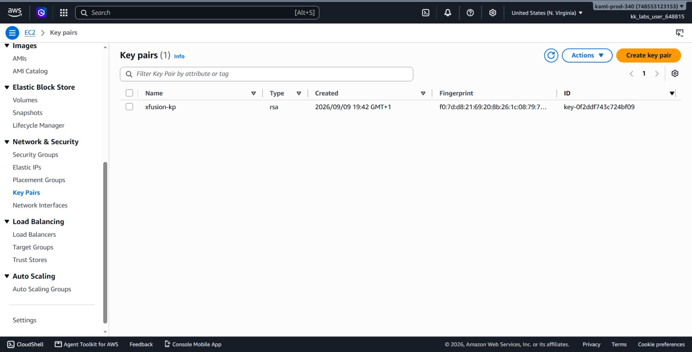
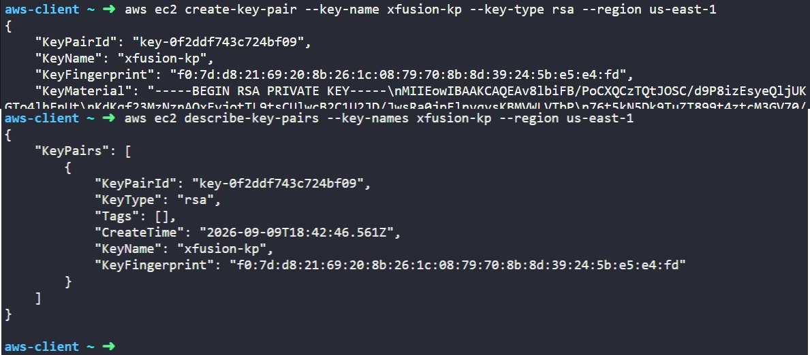

# Day 1: Create Key Pair

## Objective
The objective is to create an Amazon EC2 key pair named `xfusion-kp` of type `rsa` in the `us-east-1` region using the AWS CLI. This key pair is required to authenticate and securely SSH into future EC2 instances during the cloud migration.

## 1. EC2 Key Pairs

An **EC2 Key Pair** uses asymmetric encryption to control login access to Linux instances.

### How Key Pairs Work
A key pair consists of two parts:
1. **Public Key:** Stored directly by AWS and injected into the instance (inside `~/.ssh/authorized_keys`) when it boots up.
2. **Private Key (`KeyMaterial`):** Returned to the user at creation time. This is the private file (`.pem`) used on a local machine to prove identity when establishing an SSH connection.

AWS does not store the private key. If it is lost upon creation, it cannot be retrieved again from AWS.

### Key Types
AWS supports two main key types:
* **RSA:** The industry standard algorithm supported by almost all operating systems and SSH clients.
* **ED25519:** A newer algorithm that provides high security with smaller key sizes, but is not supported on older legacy OS images.

For this task, I explicitly selected `rsa` to guarantee compatibility across the application servers.

## 2. Command Execution

I ran the following AWS CLI command to generate the key pair:

```bash
aws ec2 create-key-pair --key-name xfusion-kp --key-type rsa --region us-east-1
```

### Argument Breakdown:
* `aws ec2`: Calls the Amazon Elastic Compute Cloud CLI service.
* `create-key-pair`: The specific API action that generates the key pair.
* `--key-name xfusion-kp`: Sets the unique identifier for the key in AWS.
* `--key-type rsa`: Specifies the RSA encryption standard.
* `--region us-east-1`: Targets the US East (N. Virginia) datacenter.

The command returned the key metadata along with the raw unencrypted private key material (`KeyMaterial`).

## 3. Verification

### CLI Verification
I queried the EC2 API to confirm the key pair was registered in the region:

```bash
aws ec2 describe-key-pairs --key-names xfusion-kp --region us-east-1
```

* `describe-key-pairs`: Lists details about key pairs in the account.
* `--key-names xfusion-kp`: Filters the output based on the name so it only returns my new key.

The terminal confirmed the key details:
* **KeyName:** `xfusion-kp`
* **KeyType:** `rsa`
* **KeyPairId:** `key-0f2ddf743c724bf09`
* **KeyFingerprint:** `f0:7d:d8:21:69:20:8b:26:1c:08:79:70:8b:8d:39:24:5b:e5:e4:fd`

### Console UI Verification
I signed into the AWS Management Console with the provided credentials and verified the resource:
1. Selected the **us-east-1 (N. Virginia)** region in the top navigation bar.
2. Navigated to **EC2** > **Network & Security** > **Key Pairs**.
3. Located `xfusion-kp` in the list, confirming that its type is displayed as **RSA** and the ID matches the CLI output.



## Result
I verified that the `xfusion-kp` RSA key pair is active in the `us-east-1` region via both the AWS CLI and the AWS Management Console. The key pair is registered and ready to be attached to EC2 instances.

## Screenshots
