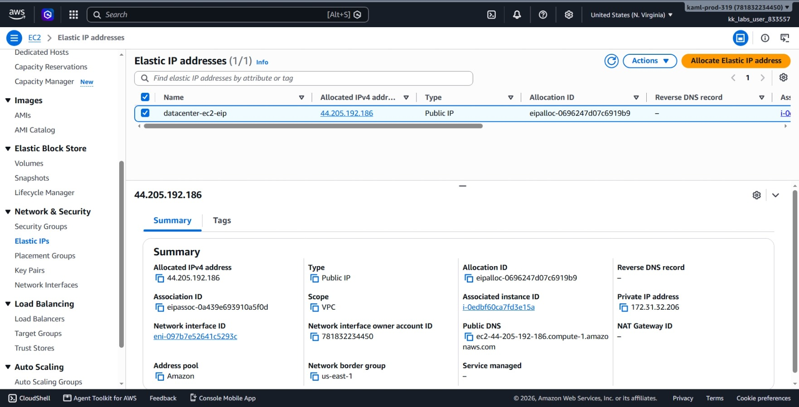
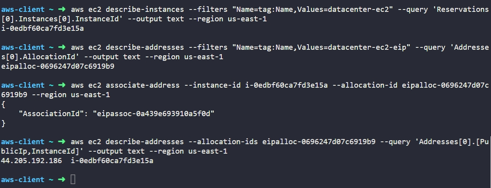

# Day 10: Attach Elastic IP to EC2 Instance

## Objective
The objective is to associate an existing static Elastic IP named `datacenter-ec2-eip` with the EC2 instance named `datacenter-ec2` in the `us-east-1` region using the AWS CLI. This provides the server with a permanent public IPv4 address that does not change across reboots or stop/start events.

## 1. Elastic IP Addresses (EIP)

An **Elastic IP (EIP)** is a reserved, static public IPv4 address allocated to an AWS account.

### Dynamic vs. Static Public IPs
* **Auto-assigned Public IPs:** Standard public IPs assigned by AWS are dynamic. Whenever an instance is stopped and restarted, its auto-assigned public IP is released back to the AWS pool and a new one is assigned.
* **Elastic IPs:** remain constant and dedicated to the account until explicitly released. It persists through stop, start, and reboot cycles.

### Allocation vs. Association
* **Allocation:** Reserving a static public IP from the AWS regional pool (`AllocationId`).
* **Association:** Linking that allocated IP to a specific EC2 instance (`AssociationId`).

When an Elastic IP is associated with an instance, it replaces the temporary auto-assigned public IP. If the instance fails or needs replacement, the same Elastic IP can be immediately re-associated with a new instance without needing to update external DNS records.

## 2. Command Execution

### Step 1: Retrieve the Instance ID
I queried the instance name tag to find the target instance ID:

```bash
aws ec2 describe-instances --filters "Name=tag:Name,Values=datacenter-ec2" --query 'Reservations[0].Instances[0].InstanceId' --output text --region us-east-1
```

* `describe-instances`: Lists EC2 instances.
* `--filters "Name=tag:Name,Values=datacenter-ec2"`: Targets the specific instance.
* `--query 'Reservations[0].Instances[0].InstanceId'`: Extracts only the instance ID string.

Target Instance ID: `i-0edbf60ca7fd3e15a`

### Step 2: Retrieve the Elastic IP Allocation ID
I queried the Elastic IP name tag to retrieve its allocation identifier:

```bash
aws ec2 describe-addresses --filters "Name=tag:Name,Values=datacenter-ec2-eip" --query 'Addresses[0].AllocationId' --output text --region us-east-1
```

* `describe-addresses`: Lists Elastic IP addresses in the account.
* `--filters "Name=tag:Name,Values=datacenter-ec2-eip"`: Finds the target EIP by its Name tag.
* `--query 'Addresses[0].AllocationId'`: Extracts the unique allocation ID.

Target Allocation ID: `eipalloc-0696247d07c6919b9`

### Step 3: Associate the Elastic IP with the Instance
I linked the static address to the running instance:

```bash
aws ec2 associate-address --instance-id i-0edbf60ca7fd3e15a --allocation-id eipalloc-0696247d07c6919b9 --region us-east-1
```

### Argument Breakdown:
* `associate-address`: Binds an Elastic IP to an instance or network interface.
* `--instance-id i-0edbf60ca7fd3e15a`: The target EC2 server.
* `--allocation-id eipalloc-0696247d07c6919b9`: The specific reserved Elastic IP.
* `--region us-east-1`: Specifies the AWS region.

Created Association ID: `eipassoc-0a439e693910a5f0d`

## 3. Verification

### CLI Verification
I queried the Elastic IP details to confirm that it is bound to the instance:

```bash
aws ec2 describe-addresses --allocation-ids eipalloc-0696247d07c6919b9 --query 'Addresses[0].[PublicIp,InstanceId]' --output text --region us-east-1
```

* `describe-addresses`: Inspects address attributes.
* `--allocation-ids eipalloc-0696247d07c6919b9`: Filters by the specific allocation ID.
* `--query 'Addresses[0].[PublicIp,InstanceId]'`: Displays the public IP and the associated instance ID.

Output:
```text
44.205.192.186  i-0edbf60ca7fd3e15a
```

### Console UI Verification
I signed into the AWS Management Console to visually confirm the association:
1. Switched to region **us-east-1 (N. Virginia)**.
2. Navigated to **EC2** > **Network & Security** > **Elastic IPs**.
3. Selected `datacenter-ec2-eip` and verified:
   * **Allocated IPv4 address:** `44.205.192.186`.
   * **Associated instance ID:** `i-0edbf60ca7fd3e15a (datacenter-ec2)`.



## Result
I verified that the `datacenter-ec2-eip` Elastic IP (`44.205.192.186`) was successfully associated with the `datacenter-ec2` instance in `us-east-1`. Both the AWS CLI and the AWS Management Console confirm the static IP binding is active.

## Screenshots

