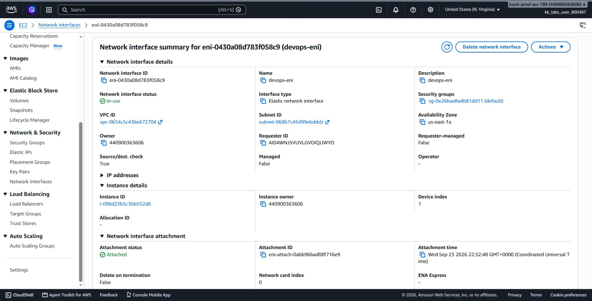
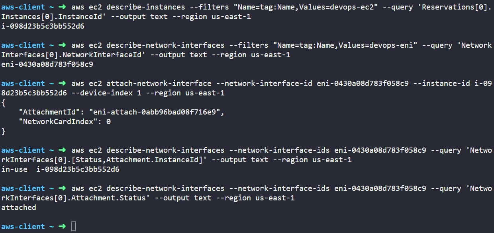

# Day 11: Attach Elastic Network Interface to EC2 Instance


## Objective
The objective is to attach an existing secondary Elastic Network Interface (ENI) named `devops-eni` to the EC2 instance named `devops-ec2` in the `us-east-1` region using the AWS CLI. This gives the instance an additional virtual network card and verifies that the attachment status reaches `attached`.

## 1. Elastic Network Interfaces (ENI)

An **Elastic Network Interface (ENI)** is a virtual network interface card (NIC) that we can attach to an EC2 instance in a VPC.

### Primary vs. Secondary Interfaces
* **Primary Interface (`eth0`):** Created by default when an instance launches. It is assigned device index `0` and cannot be detached from the instance.
* **Secondary Interface (`eth1`, `eth2`, etc.):** Additional interfaces we can create separately and attach or detach while the instance is running (hot attachment) or stopped. Each additional interface is assigned an incremental device index (such as device index `1`).

### Availability Zone Constraint
An ENI lives inside a specific subnet, which belongs to a specific Availability Zone (AZ). Because of this, an ENI can only be attached to an instance running in the exact same Availability Zone.

### Attachment Statuses
* **available:** The ENI is created but not connected to any server.
* **attaching:** AWS is establishing the link between the instance and the network card.
* **attached / in-use:** The ENI is actively connected to an instance and ready to route traffic.

## 2. Command Execution

### Step 1: Find the Instance ID
I queried the instance name tag to find the target instance ID:

```bash
aws ec2 describe-instances --filters "Name=tag:Name,Values=devops-ec2" --query 'Reservations[0].Instances[0].InstanceId' --output text --region us-east-1
```

* `describe-instances`: Retrieves information about EC2 instances.
* `--filters "Name=tag:Name,Values=devops-ec2"`: Finds the instance with the matching Name tag.
* `--query 'Reservations[0].Instances[0].InstanceId'`: Returns only the instance ID string.

Target Instance ID: `i-098d23b5c3bb552d6`

### Step 2: Find the Network Interface ID
I queried the network interface name tag to retrieve its ID:

```bash
aws ec2 describe-network-interfaces --filters "Name=tag:Name,Values=devops-eni" --query 'NetworkInterfaces[0].NetworkInterfaceId' --output text --region us-east-1
```

* `describe-network-interfaces`: Lists virtual network cards in the account.
* `--filters "Name=tag:Name,Values=devops-eni"`: Finds the specific ENI by name.
* `--query 'NetworkInterfaces[0].NetworkInterfaceId'`: Returns only the ENI ID.

Target ENI ID: `eni-0430a08d783f058c9`

### Step 3: Attach the Network Interface
I attached the secondary ENI to the running EC2 instance:

```bash
aws ec2 attach-network-interface --network-interface-id eni-0430a08d783f058c9 --instance-id i-098d23b5c3bb552d6 --device-index 1 --region us-east-1
```

### Argument Breakdown:
* `attach-network-interface`: The API action that links an ENI to an instance.
* `--network-interface-id eni-0430a08d783f058c9`: Specifies which network card to attach.
* `--instance-id i-098d23b5c3bb552d6`: Specifies the target EC2 server.
* `--device-index 1`: Sets this interface as the secondary adapter (`eth1`), since `0` is already taken by the primary interface (`eth0`).
* `--region us-east-1`: Specifies the AWS region.

Created Attachment ID: `eni-attach-0abb96bad08f716e9`

## 3. Verification

### CLI Verification
I queried the network interface to confirm that its state changed to `in-use` and its attachment status is `attached`:

```bash
# Check overall interface status and linked instance ID
aws ec2 describe-network-interfaces --network-interface-ids eni-0430a08d783f058c9 --query 'NetworkInterfaces[0].[Status,Attachment.InstanceId]' --output text --region us-east-1

# Check specific attachment status
aws ec2 describe-network-interfaces --network-interface-ids eni-0430a08d783f058c9 --query 'NetworkInterfaces[0].Attachment.Status' --output text --region us-east-1
```

Output:
```text
in-use  i-098d23b5c3bb552d6
attached
```

### Console UI Verification
I signed into the AWS Management Console to visually confirm the attachment:
1. Switched to region **us-east-1 (N. Virginia)**.
2. Navigated to **EC2** > **Network Interfaces**.
3. Selected `devops-eni` (`eni-0430a08d783f058c9`) and confirmed:
   * **Status:** Displays as **In-use**.
   * **Attached instance ID:** Displays as `i-098d23b5c3bb552d6 (devops-ec2)`.



## Result
I verified that the `devops-eni` network interface was successfully attached as device index 1 to the `devops-ec2` instance in `us-east-1`. Both the AWS CLI and the AWS Management Console confirm the attachment status is `attached` and the interface status is `in-use`.

## Screenshots
