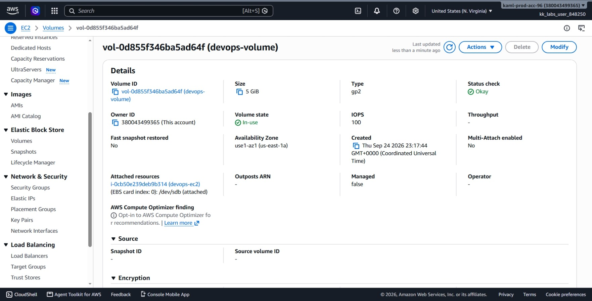
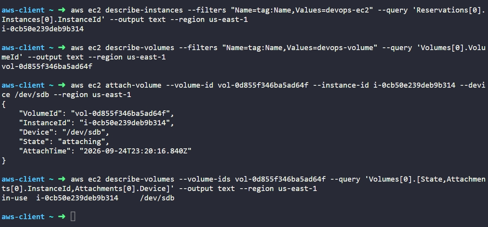

# Day 12: Attach Volume to EC2 Instance


## Objective
The objective is to attach an existing Amazon Elastic Block Store (EBS) volume named `devops-volume` to the EC2 instance named `devops-ec2` in the `us-east-1` region using the AWS CLI. The volume must be attached to the instance using the device name `/dev/sdb`.

## 1. Attaching EBS Volumes

An **EBS Volume attachment** connects an independent block storage volume to an EC2 instance so the operating system can use it as additional disk space.

### Availability Zone Requirement
An EBS volume is physically located in a specific Availability Zone (AZ). Because of this hardware boundary, an EBS volume can only be attached to an EC2 instance that is running in the exact same Availability Zone.

### Device Naming
When attaching a volume, AWS requires a target **device name** (such as `/dev/sdb`).
* In Linux, a **device name is the path Linux uses to identify a piece of hardware or virtual hardware**. For an EBS volume, `/dev/sdb` identifies the attached disk so the operating system can access it.

### Attachment Lifecycle
* **available:** The volume is detached and ready for use.
* **attaching:** AWS is mapping the volume to the instance hypervisor.
* **in-use:** The volume is securely attached to the instance and ready to be mounted by the OS.

## 2. Command Execution

### Step 1: Find the Instance ID
I queried the instance name tag to retrieve its unique identifier:

```bash
aws ec2 describe-instances --filters "Name=tag:Name,Values=devops-ec2" --query 'Reservations[0].Instances[0].InstanceId' --output text --region us-east-1
```

* `describe-instances`: Lists EC2 instances.
* `--filters "Name=tag:Name,Values=devops-ec2"`: Finds the instance with the exact Name tag.
* `--query 'Reservations[0].Instances[0].InstanceId'`: Returns only the instance ID string.

Target Instance ID: `i-0cb50e239deb9b314`

### Step 2: Find the Volume ID
I queried the volume name tag to find the volume ID:

```bash
aws ec2 describe-volumes --filters "Name=tag:Name,Values=devops-volume" --query 'Volumes[0].VolumeId' --output text --region us-east-1
```

* `describe-volumes`: Lists EBS volumes in the account.
* `--filters "Name=tag:Name,Values=devops-volume"`: Targets the volume named `devops-volume`.
* `--query 'Volumes[0].VolumeId'`: Returns only the volume ID string.

Target Volume ID: `vol-0d855f346ba5ad64f`

### Step 3: Attach the Volume
I attached the EBS volume to the instance as device `/dev/sdb`:

```bash
aws ec2 attach-volume --volume-id vol-0d855f346ba5ad64f --instance-id i-0cb50e239deb9b314 --device /dev/sdb --region us-east-1
```

### Argument Breakdown:
* `attach-volume`: The API action that links an EBS volume to an EC2 instance.
* `--volume-id vol-0d855f346ba5ad64f`: The specific EBS storage disk to attach.
* `--instance-id i-0cb50e239deb9b314`: The target virtual server.
* `--device /dev/sdb`: The device path exposed to the instance operating system.
* `--region us-east-1`: Specifies the AWS region.

## 3. Verification

### CLI Verification
I queried the volume's attachment information to confirm that its state changed to `attached` / `in-use`:

```bash
aws ec2 describe-volumes --volume-ids vol-0d855f346ba5ad64f --query 'Volumes[0].Attachments[0].[State,Device,InstanceId]' --output text --region us-east-1
```

Output:
```text
in-use  /dev/sdb  i-0cb50e239deb9b314
```

### Console UI Verification
I signed into the AWS Management Console to visually confirm the attachment:
1. Switched to region **us-east-1 (N. Virginia)**.
2. Navigated to **EC2** > **Elastic Block Store** > **Volumes**.
3. Selected `devops-volume` (`vol-0d855f346ba5ad64f`) and verified:
   * **Volume state:** Displays as **In-use**.
   * **Attached instances:** Shows `i-0cb50e239deb9b314: /dev/sdb (attached)`.
4. Navigated to **EC2** > **Instances**, selected `devops-ec2`, clicked the **Storage** tab, and confirmed that `/dev/sdb` is listed under **Block devices**.



## Result
I verified that the `devops-volume` EBS volume was successfully attached to the `devops-ec2` instance as `/dev/sdb` in `us-east-1`. Both the AWS CLI and the AWS Management Console confirm the volume status is `in-use` and linked to the correct instance.

## Screenshots

