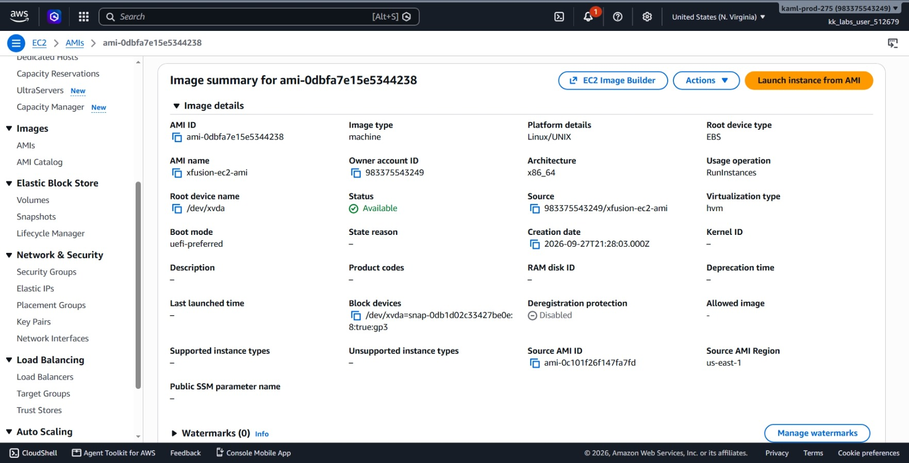
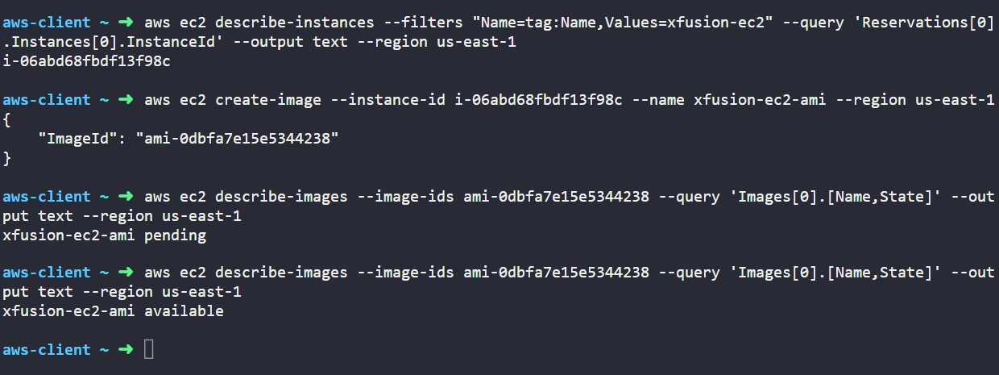

# Day 13: Create AMI from EC2 Instance


## Objective
The objective is to create a custom Amazon Machine Image (AMI) named `xfusion-ec2-ami` from an existing running EC2 instance named `xfusion-ec2` in the `us-east-1` region using the AWS CLI. The image must capture the instance's state and transition to the `available` status so it can be used as a template to launch identical servers.

## 1. Amazon Machine Images (AMI)

An **Amazon Machine Image (AMI)** is a template used to create new EC2 instances. It contains the operating system, installed software, and data from an existing EC2 instance.

### How Image Creation Works

When we create an AMI from an existing EC2 instance:

1. **File System Sync:** AWS makes sure the data currently being written to the disk is saved properly before creating the AMI. By default, AWS briefly stops the instance during this process unless the `--no-reboot` option is used.

2. **EBS Snapshots:** AWS creates snapshots of the instance's EBS volumes. These snapshots are used to store the disk data that will be included in the AMI.

3. **AMI Registration:** AWS creates the AMI and records which snapshots and settings belong to it. The AMI can then be used to launch new EC2 instances.

### AMI Lifecycle States

* **`pending`:** AWS is still creating the snapshots and preparing the AMI. The AMI cannot be used yet.

* **`available`:** The AMI is ready and can be used to launch new EC2 instances.

* **`failed`:** AWS could not finish creating the AMI because an error occurred.

## 2. Command Execution

### Step 1: Find the Instance ID
I queried the instance name tag to find the target instance ID:

```bash
aws ec2 describe-instances --filters "Name=tag:Name,Values=xfusion-ec2" --query 'Reservations[0].Instances[0].InstanceId' --output text --region us-east-1
```

* `describe-instances`: Retrieves information about EC2 instances.
* `--filters "Name=tag:Name,Values=xfusion-ec2"`: Filters specifically for the instance named `xfusion-ec2`.
* `--query 'Reservations[0].Instances[0].InstanceId'`: Returns only the instance ID string.

Target Instance ID: `i-06abd68fbdf13f98c`

### Step 2: Create the Image (AMI)
I initiated the AMI creation from the running instance:

```bash
aws ec2 create-image --instance-id i-06abd68fbdf13f98c --name xfusion-ec2-ami --region us-east-1
```

### Argument Breakdown:
* `create-image`: The API action that creates an AMI from an EC2 instance.
* `--instance-id i-06abd68fbdf13f98c`: The source virtual server to clone.
* `--name xfusion-ec2-ami`: The name assigned to the new AMI.
* `--region us-east-1`: Specifies the AWS region.

Created AMI ID: `ami-0dbfa7e15e5344238`

## 3. Verification

### CLI Verification
Because snapshot creation takes time depending on the disk size, the image starts in a `pending` state. I monitored the state using `describe-images` until it completed:

```bash
aws ec2 describe-images --image-ids ami-0dbfa7e15e5344238 --query 'Images[0].[Name,State]' --output text --region us-east-1
```

* `describe-images`: Queries information about registered AMIs.
* `--image-ids ami-0dbfa7e15e5344238`: Filters for the newly created AMI.
* `--query 'Images[0].[Name,State]'`: Displays the name and current build state.

Initial checks:
```text
xfusion-ec2-ami pending
```

Final check once complete:
```text
xfusion-ec2-ami available
```

### Console UI Verification
I signed into the AWS Management Console to visually confirm the AMI status:
1. Switched to region **us-east-1 (N. Virginia)**.
2. Navigated to **EC2** > **Images** > **AMIs**.
3. Located `xfusion-ec2-ami` (`ami-0dbfa7e15e5344238`) and verified:
   * **AMI name:** `xfusion-ec2-ami`.
   * **Status:** Displays as **Available** (green indicator).
   * **Source:** Matches the snapshot generated from `i-06abd68fbdf13f98c`.



## Result
I verified that the `xfusion-ec2-ami` AMI was successfully created from the `xfusion-ec2` instance in `us-east-1`. Both the AWS CLI and the AWS Management Console confirm the image is in the `available` state and ready to launch new instances.

## Screenshots
