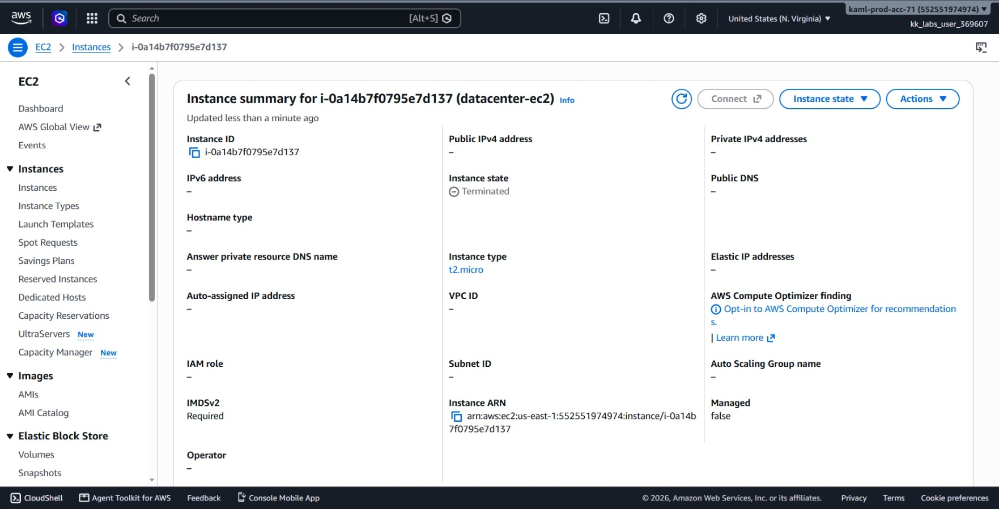
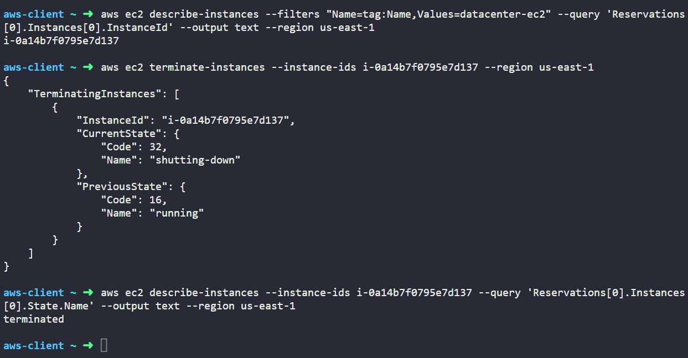

# Day 14: Terminate EC2 Instance

## Objective
The objective is to permanently delete an unused EC2 instance named `datacenter-ec2` in the `us-east-1` region using the AWS CLI, and verify that the instance reaches the `terminated` state.

## 1. EC2 Instance Termination

Terminating an EC2 instance means permanently deleting the virtual server from your AWS account.

### How Termination Works

When we terminate an EC2 instance:

1. **State Change:** The instance immediately stops running and moves to the `shutting-down` state, and then moves to the `terminated` state.

2. **Permanent Action:** Once an instance is terminated, it cannot be started or recovered again.

3. **Storage Cleanup:** By default, the root EBS volume attached to the instance is deleted automatically when the instance is terminated.

4. **Console History:** The terminated instance stays visible in the AWS console and CLI for a few hours with a status of `terminated` before AWS removes it completely from the list.

## 2. Command Execution

### Step 1: Find the Instance ID
I retrieved the ID of the instance using its Name tag:

```bash
aws ec2 describe-instances --filters "Name=tag:Name,Values=datacenter-ec2" --query 'Reservations[0].Instances[0].InstanceId' --output text --region us-east-1
```

* `describe-instances`: Lists EC2 instances.
* `--filters "Name=tag:Name,Values=datacenter-ec2"`: Finds the instance named `datacenter-ec2`.
* `--query 'Reservations[0].Instances[0].InstanceId'`: Returns only the instance ID.

Target Instance ID: `i-0a14b7f0795e7d137`

### Step 2: Terminate the Instance
I terminated the instance using its ID:

```bash
aws ec2 terminate-instances --instance-ids i-0a14b7f0795e7d137 --region us-east-1
```

### Argument Breakdown:
* `terminate-instances`: The API command that deletes one or more EC2 instances.
* `--instance-ids i-0a14b7f0795e7d137`: The ID of the instance to delete.
* `--region us-east-1`: Specifies the AWS region.

The command showed the instance changing from `running` to `shutting-down`.

## 3. Verification

### CLI Verification
I checked the state of the instance to confirm it finished shutting down and is now terminated:

```bash
aws ec2 describe-instances --instance-ids i-0a14b7f0795e7d137 --query 'Reservations[0].Instances[0].State.Name' --output text --region us-east-1
```

Output:
```text
terminated
```

### Console UI Verification
I logged into the AWS Management Console to confirm the status:
1. Selected region **us-east-1 (N. Virginia)**.
2. Went to **EC2** > **Instances**.
3. Located `datacenter-ec2` (`i-0a14b7f0795e7d137`) in the list.
4. Verified that the **Instance state** column displays **Terminated**.



## Result
I verified that the `datacenter-ec2` instance in `us-east-1` was successfully deleted. Both the AWS CLI and the AWS Management Console confirm the instance state is `terminated`.

## Screenshots
