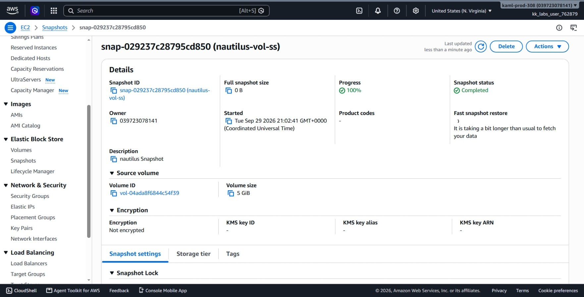
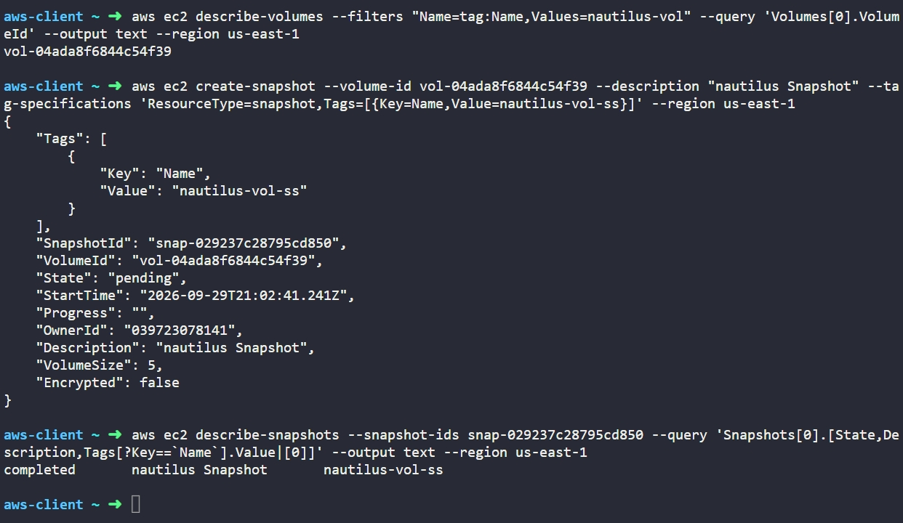

# Day 15: Create Volume Snapshot


## Objective
The objective is to create a snapshot of an existing EBS volume named `nautilus-vol` in the `us-east-1` region using the AWS CLI. The snapshot must be named `nautilus-vol-ss`, have the description `nautilus Snapshot`, and reach the `completed` state.

## 1. EBS Snapshots

An **EBS snapshot** is a point-in-time backup of an Amazon EBS volume.

### How Snapshots Work

When we create a snapshot of an EBS volume:

1. **Data Backup:** AWS copies the data from the EBS volume and stores it securely in Amazon S3 in the background.

2. **Incremental Backups:** Snapshots are incremental. This means only the blocks of data that changed since the last snapshot are saved, which saves storage space and time.

3. **Snapshot States:**
   * `pending`: AWS is still copying the data from the volume.
   * `completed`: The backup is finished and ready to use.
   * `error`: The snapshot process failed.

4. **Creating New Volumes:** we can use a completed snapshot to restore data or create a brand new EBS volume in any Availability Zone in the same region.

## 2. Command Execution

### Step 1: Find the Volume ID
I looked up the volume ID for `nautilus-vol`:

```bash
aws ec2 describe-volumes --filters "Name=tag:Name,Values=nautilus-vol" --query 'Volumes[0].VolumeId' --output text --region us-east-1
```

* `describe-volumes`: Lists EBS volumes.
* `--filters "Name=tag:Name,Values=nautilus-vol"`: Searches for the volume named `nautilus-vol`.
* `--query 'Volumes[0].VolumeId'`: Returns only the volume ID.

Target Volume ID: `vol-04ada8f6844c54f39`

### Step 2: Create the Snapshot
I started the snapshot creation with the required description and name tag:

```bash
aws ec2 create-snapshot --volume-id vol-04ada8f6844c54f39 --description "nautilus Snapshot" --tag-specifications 'ResourceType=snapshot,Tags=[{Key=Name,Value=nautilus-vol-ss}]' --region us-east-1
```

### Argument Breakdown:
* `create-snapshot`: The command that starts a snapshot of an EBS volume.
* `--volume-id vol-04ada8f6844c54f39`: Specifies which volume to back up.
* `--description "nautilus Snapshot"`: Adds a short note describing the snapshot.
* `--tag-specifications`: Sets the Name tag to `nautilus-vol-ss` at creation time.
* `--region us-east-1`: Specifies the AWS region.

Created Snapshot ID: `snap-029237c28795cd850`

## 3. Verification

### CLI Verification
I checked the snapshot status to confirm it finished copying and reached the `completed` state:

```bash
aws ec2 describe-snapshots --snapshot-ids snap-029237c28795cd850 --query 'Snapshots[0].[State,Description,Tags[?Key==`Name`].Value|[0]]' --output text --region us-east-1
```

* `describe-snapshots`: Checks details about snapshots in the account.
* `--snapshot-ids snap-029237c28795cd850`: Filters for the new snapshot.
* `--query`: Shows the state, description, and Name tag.

Output:
```text
completed       nautilus Snapshot       nautilus-vol-ss
```

### Console UI Verification
I logged into the AWS Management Console to visually confirm the snapshot:
1. Selected region **us-east-1 (N. Virginia)**.
2. Navigated to **EC2** > **Elastic Block Store** > **Snapshots**.
3. Located `nautilus-vol-ss` (`snap-029237c28795cd850`) in the list and verified:
   * **Name:** `nautilus-vol-ss`.
   * **Status:** Displays as **Completed** (100%).
   * **Description:** Displays as `nautilus Snapshot`.
   * **Volume ID:** Matches `vol-04ada8f6844c54f39`.



## Result
I verified that the snapshot `nautilus-vol-ss` was successfully created from the `nautilus-vol` volume in `us-east-1`. Both the AWS CLI and the AWS Management Console confirm the snapshot is in the `completed` state and ready for recovery use.

## Screenshots

