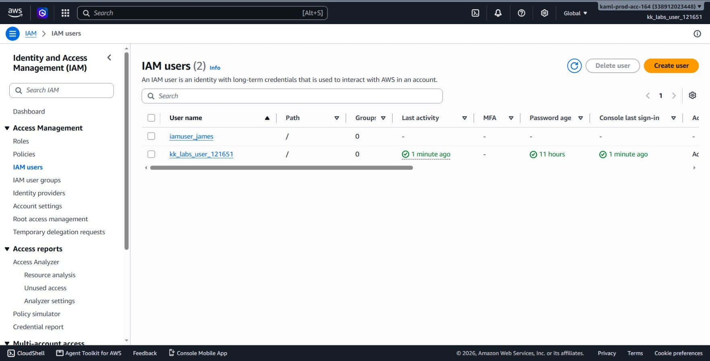
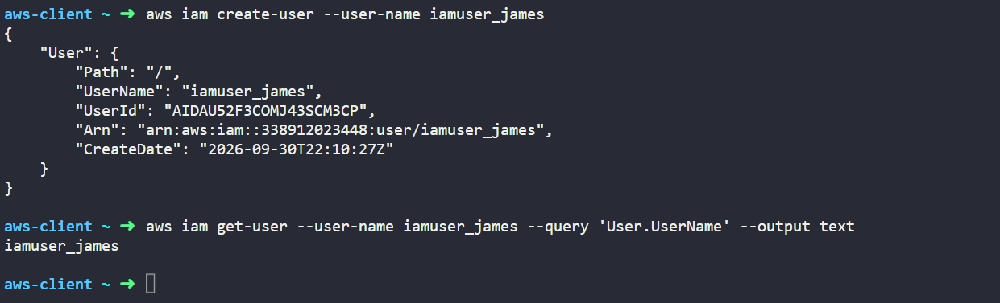

# Day 16: Create IAM User


## Objective
The objective is to create a new AWS Identity and Access Management (IAM) user named `iamuser_james` using the AWS CLI. This establishes a dedicated identity for access control and user management within the AWS account.

## 1. AWS IAM Users

An **IAM user** is an identity created inside our AWS account that represents a person or an application that interacts with AWS.

### How IAM Users Work

1. **Global Service:** IAM is a global service. IAM users are not tied to a specific region; they exist across the entire AWS account.

2. **Default Permissions:** A newly created IAM user has **no permissions** by default. They cannot view or touch any AWS resources until we attach an IAM policy directly to them or add them to an IAM group that has permissions.

3. **Authentication:** An IAM user can be given two types of access:
   * **Console Access:** A username and password to log into the web browser interface.
   * **Programmatic Access:** Access keys (Access Key ID and Secret Access Key) to use with the AWS CLI or code scripts.

When we create a user using `create-user`, it creates only the user identity. Credentials and permissions are added later as needed.

## 2. Command Execution

I created the IAM user using the `aws iam create-user` command:

```bash
aws iam create-user --user-name iamuser_james
```

### Argument Breakdown:
* `aws iam`: Calls the AWS Identity and Access Management service.
* `create-user`: The command that creates a new IAM user in the account.
* `--user-name iamuser_james`: Sets the name of the new user.

Created User Details:
* **UserName:** `iamuser_james`
* **UserId:** `AIDAU52F3COMJ43SCM3CP`
* **Arn:** `arn:aws:iam::338912023448:user/iamuser_james`

## 3. Verification

### CLI Verification
I queried the IAM service to confirm the user was created:

```bash
aws iam get-user --user-name iamuser_james --query 'User.UserName' --output text
```

* `get-user`: Retrieves details about an existing IAM user.
* `--user-name iamuser_james`: Specifies the user to look up.
* `--query 'User.UserName'`: Extracts just the user name field.
* `--output text`: Displays the output as plain text.

Output:
```text
iamuser_james
```

### Console UI Verification
I signed into the AWS Management Console to visually confirm the user:
1. Navigated to the **IAM** service dashboard (IAM is Global, so no region selection is needed).
2. Selected **Users** from the left-hand navigation menu.
3. Located `iamuser_james` in the users list and verified:



## Result
I verified that the `iamuser_james` IAM user was successfully created in the AWS account. Both the AWS CLI and the AWS Management Console confirm the user identity exists and is ready for credentials and permissions to be assigned.

## Screenshots
