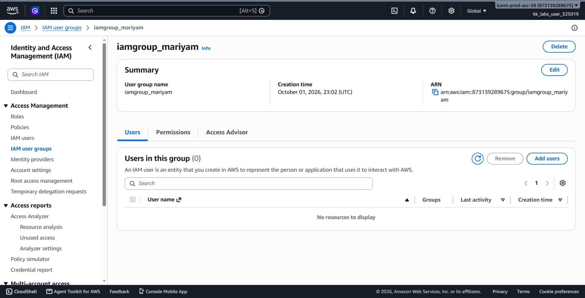
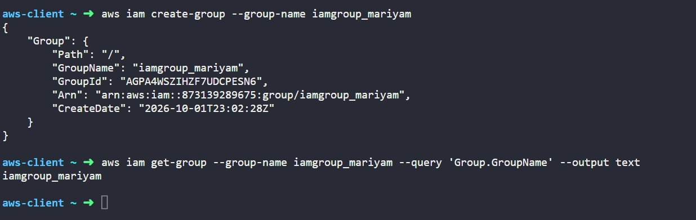

# Day 17: Create IAM Group


## Objective
The objective is to create a new AWS Identity and Access Management (IAM) user group named `iamgroup_mariyam` using the AWS CLI. This group allows for easier permission management by organizing users into a shared collection.

## 1. AWS IAM User Groups

An **IAM user group** is a collection of IAM users.

### How IAM Groups Work

1. **Shared Permissions:** Instead of attaching policies to each user individually, we attach policies to a group. Any user added to that group automatically gets those permissions.

2. **Management Only:** A group is not an identity that can log in. A group cannot have passwords or access keys. Its only purpose is to assign permissions to multiple users at once.

3. **No Nesting:** Groups can contain multiple users, and a single user can belong to multiple groups. However, groups cannot contain other groups.

4. **Global Service:** Like IAM users, IAM user groups are global and exist across the entire AWS account rather than in a specific region.

## 2. Command Execution

I created the IAM group using the `aws iam create-group` command:

```bash
aws iam create-group --group-name iamgroup_mariyam
```

### Argument Breakdown:
* `aws iam`: Calls the AWS Identity and Access Management service.
* `create-group`: The command that creates a new user group in the account.
* `--group-name iamgroup_mariyam`: Sets the name of the new group.

Created Group Details:
* **GroupName:** `iamgroup_mariyam`
* **GroupId:** `AGPA4WSZIHZF7UDCPESN6`
* **Arn:** `arn:aws:iam::873139289675:group/iamgroup_mariyam`

## 3. Dual Verification

### CLI Verification
I queried the IAM service to confirm the group was created:

```bash
aws iam get-group --group-name iamgroup_mariyam --query 'Group.GroupName' --output text
```

* `get-group`: Returns details about a group and lists the users in it.
* `--group-name iamgroup_mariyam`: Specifies which group to check.
* `--query 'Group.GroupName'`: Extracts just the group name.
* `--output text`: Displays the output as plain text.

Output:
```text
iamgroup_mariyam
```

### Console UI Verification
I signed into the AWS Management Console to visually confirm the group:
1. Navigated to the **IAM** service console (IAM is Global).
2. Selected **User groups** from the left-hand navigation menu.
3. Located `iamgroup_mariyam` in the list and verified:
   * **Group name:** Displays as `iamgroup_mariyam`.
   * **Users:** Shows `0` users currently assigned.
   * **Permissions:** Shows `0` attached policies.



## Result
I verified that the `iamgroup_mariyam` IAM group was successfully created in the AWS account. Both the AWS CLI and the AWS Management Console confirm the group exists and is ready for users and permissions to be added.

## Screenshots
