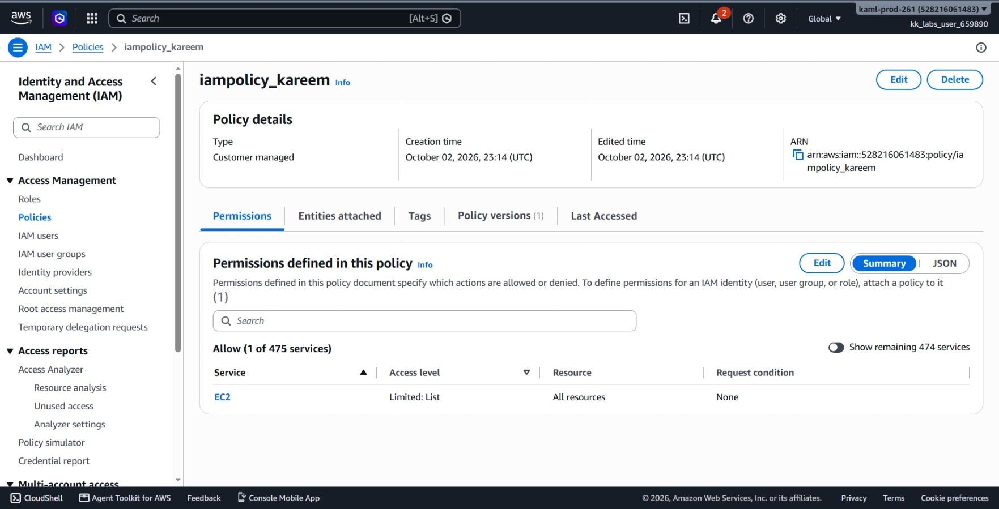
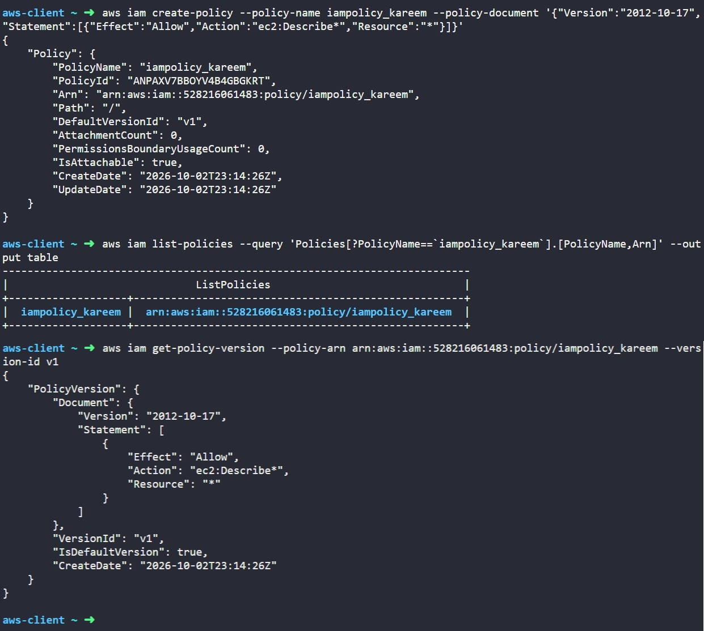

# Day 18: Create Read-Only IAM Policy for EC2 Console Access


## Objective
The objective is to create a custom AWS Identity and Access Management (IAM) policy named `iampolicy_kareem` using the AWS CLI. The policy must allow read-only access to the EC2 console so users can view instances, AMIs, and snapshots without being able to make changes.

## 1. IAM Policies

An **IAM policy** is a JSON document that defines which AWS actions are allowed or denied for an identity.

### Policy Structure
An IAM policy mainly defines three elements:
1. **Effect:** Specifies whether the statement allows or denies an action. Usually set to `"Allow"` when granting permissions.
2. **Action:** Specifies the AWS API actions that are permitted. For example, `ec2:Describe*` allows all read-only inspection commands across EC2.
3. **Resource:** Specifies which AWS resources the permission applies to. `*` means all resources in the account.

### Default Access
IAM follows a **default-deny model**. A user has no permissions unless an applicable policy explicitly grants them access.

### Read-Only Access & Least Privilege
For this task, the policy uses the action `ec2:Describe*`:
* It allows viewing instances, AMIs, snapshots, and related EC2 resources in the console.
* It does not grant permissions to start, stop, launch, or delete any resources.

This follows the **Principle of Least Privilege**: grant only the read permissions needed to view information.

## 2. Command Execution

I created the managed policy using the `aws iam create-policy` command:

```bash
aws iam create-policy --policy-name iampolicy_kareem --policy-document '{"Version":"2012-10-17","Statement":[{"Effect":"Allow","Action":"ec2:Describe*","Resource":"*"}]}'
```

### Argument Breakdown:
* `aws iam`: Calls the AWS Identity and Access Management service.
* `create-policy`: The command that creates a new standalone customer-managed policy.
* `--policy-name iampolicy_kareem`: Names the policy.
* `--policy-document`: The JSON document string that specifies the `Allow` effect for `ec2:Describe*` actions on all resources (`*`).

Created Policy Details:
* **PolicyName:** `iampolicy_kareem`
* **PolicyId:** `ANPAXV7BBOYV4B4GBGKRT`
* **Arn:** `arn:aws:iam::528216061483:policy/iampolicy_kareem`

## 3. Verification

### CLI Verification
First, I listed the policy to verify it exists in the account:

```bash
aws iam list-policies --query 'Policies[?PolicyName==`iampolicy_kareem`].[PolicyName,Arn]' --output table
```

Output:
```text
---------------------------------------------------------------------------
|                              ListPolicies                               |
+-------------------+-----------------------------------------------------+
|  iampolicy_kareem |  arn:aws:iam::528216061483:policy/iampolicy_kareem  |
+-------------------+-----------------------------------------------------+
```

Next, I checked the default version of the policy to verify the statement rules:

```bash
aws iam get-policy-version --policy-arn arn:aws:iam::528216061483:policy/iampolicy_kareem --version-id v1
```

* `get-policy-version`: Retrieves the JSON document for a specific policy version.
* `--policy-arn`: The Amazon Resource Name of the policy.
* `--version-id v1`: Inspects version 1.

The output confirmed the active policy document:
```json
{
    "Effect": "Allow",
    "Action": "ec2:Describe*",
    "Resource": "*"
}
```

### Console UI Verification
I signed into the AWS Management Console to visually confirm the policy:
1. Navigated to the **IAM** service console.
2. Selected **Policies** from the left navigation menu.
3. Filtered the list by **Customer managed** and searched for `iampolicy_kareem`.
4. Clicked on the policy and checked the **Permissions** tab:
   * **Service:** Shows **EC2**.
   * **Access level:** Shows **List**.



## Result
I verified that the `iampolicy_kareem` policy was successfully created. Both the AWS CLI and the AWS Management Console confirm the policy is active with read-only permissions for EC2 resources.

## Screenshots
