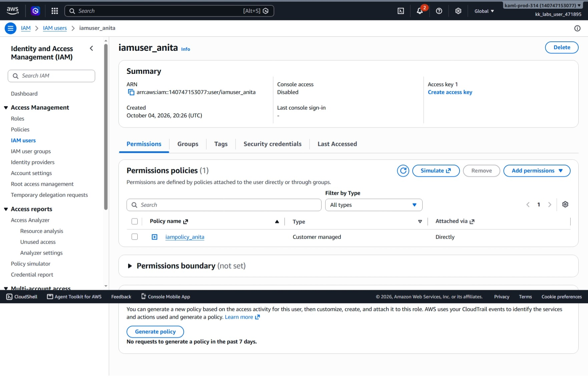
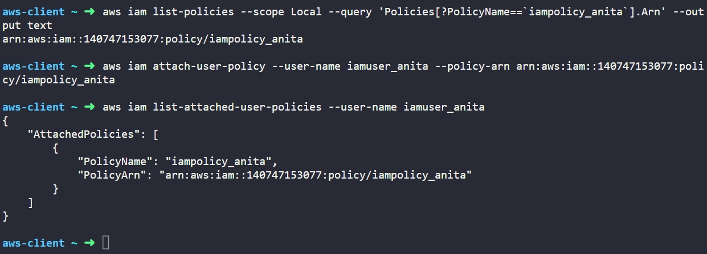

# Day 19: Attach IAM Policy to IAM User


## Objective
The objective is to attach an existing customer-managed IAM policy named `iampolicy_anita` to the IAM user `iamuser_anita` using the AWS CLI. This grants the user the specific permissions defined inside the policy document.

## 1. Attaching IAM Policies

An **IAM policy attachment** links permission rules to an identity (such as a user, group, or role).

### How Policy Attachment Works

1. **Separation of Policy and User:** In AWS, policies exist as separate objects from users. Creating a policy does not grant any access until you attach it to an identity.

2. **Managed Policies:** `iampolicy_anita` is a managed policy. This means it has its own Amazon Resource Name (ARN) and can be attached to or detached from multiple users or groups without editing the policy itself.

3. **Direct Attachment:** Attaching a policy directly to a user gives that specific user all the permissions listed in the policy immediately.

4. **Immediate Effect:** As soon as a policy is attached, AWS applies the permissions right away. The user does not need to log out or refresh credentials.

## 2. Command Execution

### Step 1: Find the Policy ARN
I queried the IAM service to retrieve the unique Amazon Resource Name (ARN) for `iampolicy_anita`:

```bash
aws iam list-policies --scope Local --query 'Policies[?PolicyName==`iampolicy_anita`].Arn' --output text
```

* `list-policies`: Lists managed policies in the AWS account.
* `--scope Local`: Filters to show only customer-created policies (ignoring default AWS-managed policies).
* `--query 'Policies[?PolicyName==`iampolicy_anita`].Arn'`: Searches for the policy by name and extracts only its ARN.
* `--output text`: Returns the ARN as clean plain text.

Target Policy ARN: `arn:aws:iam::140747153077:policy/iampolicy_anita`

### Step 2: Attach the Policy to the User
I attached the policy to `iamuser_anita` using its ARN:

```bash
aws iam attach-user-policy --user-name iamuser_anita --policy-arn arn:aws:iam::140747153077:policy/iampolicy_anita
```

### Argument Breakdown:
* `aws iam`: Calls the Identity and Access Management service.
* `attach-user-policy`: The command that links a managed policy to a specific user.
* `--user-name iamuser_anita`: Specifies the user receiving the permissions.
* `--policy-arn`: Specifies the full ARN of the policy being attached.

## 3. Verification

### CLI Verification
I queried the user's attached policies to confirm the attachment was successful:

```bash
aws iam list-attached-user-policies --user-name iamuser_anita
```

* `list-attached-user-policies`: Lists all managed policies attached directly to a specific user.
* `--user-name iamuser_anita`: The user to inspect.

Output:
```json
{
    "AttachedPolicies": [
        {
            "PolicyName": "iampolicy_anita",
            "PolicyArn": "arn:aws:iam::140747153077:policy/iampolicy_anita"
        }
    ]
}
```

### Console UI Verification
I signed into the AWS Management Console to visually confirm the attached policy:
1. Navigated to the **IAM** service console.
2. Selected **Users** from the left navigation menu.
3. Clicked on `iamuser_anita`.
4. Opened the **Permissions** tab and verified:
   * `iampolicy_anita` is listed under **Permissions policies**.
   * **Type:** Displays as **Customer managed**.
   * **Attached directly:** Displays as **Direct**.



## Result
I verified that the `iampolicy_anita` policy was successfully attached to `iamuser_anita`. Both the AWS CLI and the AWS Management Console confirm the policy is active and the user now has the permissions defined in the policy.

## Screenshots

