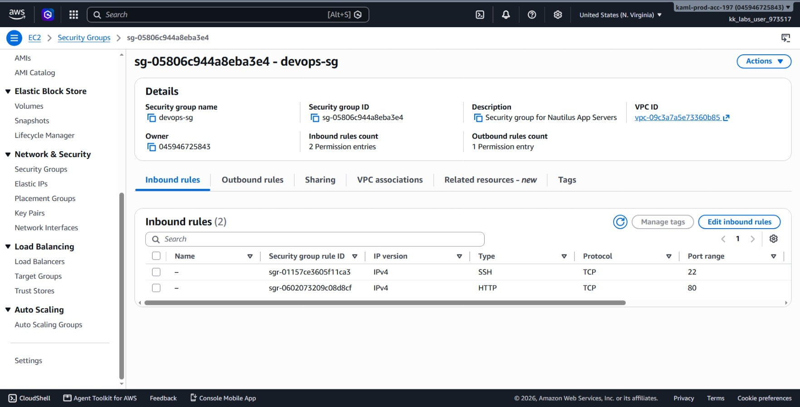
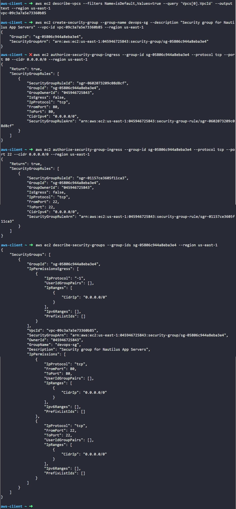

# Day 2: Create Security Group


## Objective
The objective is to create an AWS Security Group named `devops-sg` under the default VPC in the `us-east-1` region using the AWS CLI. The security group must act as a firewall for the Nautilus App Servers by allowing inbound traffic for HTTP (port 80) and SSH (port 22) from any IPv4 source (`0.0.0.0/0`).

## 1. AWS Security Groups

A **Security Group** is a virtual, stateful firewall that controls incoming and outgoing network traffic for AWS resources like EC2 instances.

### Stateful Filtering
Security groups are **stateful**. If an inbound request is permitted (such as an incoming HTTP request on port 80), the response traffic leaving the instance is automatically allowed, regardless of the outbound rules.

### Default Traffic Rules
* **Inbound (Ingress):** All incoming traffic is blocked by default. We have to explicitly create allow rules for every port, protocol, and IP range that needs access.
* **Outbound (Egress):** All outgoing traffic is allowed by default (`0.0.0.0/0` across all protocols).

### Rule Structure
Each security group rule defines:
1. **Protocol:** The transport protocol (such as `tcp`, `udp`, or `-1` for all protocols).
2. **Port Range:** The target port for the service (such as `80` for HTTP or `22` for SSH).
3. **Source / Destination:** The IP range in CIDR notation (such as `0.0.0.0/0` for public access).

## 2. Command Execution

### Step 1: Identify the Default VPC ID
Before creating the security group, I queried AWS to retrieve the ID of the default VPC in the region:

```bash
aws ec2 describe-vpcs --filters Name=isDefault,Values=true --query 'Vpcs[0].VpcId' --output text --region us-east-1
```

* `describe-vpcs`: Lists details about VPCs.
* `--filters Name=isDefault,Values=true`: Filters the list to match only the default VPC.
* `--query 'Vpcs[0].VpcId'`: Extracts just the VPC ID string from the JSON response.
* `--output text`: Formats the returned result as plain text instead of JSON.

Target VPC ID found: `vpc-09c3a7a5e73360b85`

### Step 2: Create the Security Group
I created the security group inside the identified VPC:

```bash
aws ec2 create-security-group --group-name devops-sg --description "Security group for Nautilus App Servers" --vpc-id vpc-09c3a7a5e73360b85 --region us-east-1
```

* `create-security-group`: The API action that initializes a new security group.
* `--group-name devops-sg`: The name tag identifier for the group.
* `--description`: A brief description explaining what the security group is used for.
* `--vpc-id`: Binds the security group to the specific target VPC.

Created Security Group ID: `sg-05806c944a8eba3e4`

### Step 3: Add Inbound Rule for HTTP (Port 80)
I authorized incoming HTTP web traffic:

```bash
aws ec2 authorize-security-group-ingress --group-id sg-05806c944a8eba3e4 --protocol tcp --port 80 --cidr 0.0.0.0/0 --region us-east-1
```

* `authorize-security-group-ingress`: Adds inbound allow rules to an existing security group.
* `--group-id`: Specifies which security group to update.
* `--protocol tcp`: Uses the TCP transport protocol.
* `--port 80`: Sets both from-port and to-port to 80 (standard HTTP).
* `--cidr 0.0.0.0/0`: Allows access from any IPv4 address on the internet.

### Step 4: Add Inbound Rule for SSH (Port 22)
I authorized incoming SSH administration traffic:

```bash
aws ec2 authorize-security-group-ingress --group-id sg-05806c944a8eba3e4 --protocol tcp --port 22 --cidr 0.0.0.0/0 --region us-east-1
```

* `--port 22`: Sets the inbound target port to 22 (standard SSH).
* `--cidr 0.0.0.0/0`: Allows connection attempts from any IP address.

## 3. Verification

### CLI Verification
I queried the security group configuration to confirm that both inbound rules were properly attached:

```bash
aws ec2 describe-security-groups --group-ids sg-05806c944a8eba3e4 --region us-east-1
```

* `describe-security-groups`: Displays detailed configuration and active rules.
* `--group-ids`: Targets the specific security group ID.

The output confirmed:
* **GroupName:** `devops-sg`
* **VpcId:** `vpc-09c3a7a5e73360b85`
* **Inbound Rules (`IpPermissions`):** Port 80 (TCP) and Port 22 (TCP) both mapped to `0.0.0.0/0`.
* **Outbound Rules (`IpPermissionsEgress`):** All traffic (`protocol: -1`) allowed to `0.0.0.0/0` by default.

### Console UI Verification
I signed into the AWS Management Console to visually confirm the resource:
1. Selected the **us-east-1 (N. Virginia)** region.
2. Navigated to **EC2** > **Network & Security** > **Security Groups**.
3. Selected `devops-sg` (`sg-05806c944a8eba3e4`).
4. Inspected the **Inbound rules** tab and confirmed:
   * Rule 1: Type **HTTP**, Protocol **TCP**, Port range **80**, Source **0.0.0.0/0**.
   * Rule 2: Type **SSH**, Protocol **TCP**, Port range **22**, Source **0.0.0.0/0**.



## Result
I verified that the `devops-sg` security group was created in the default VPC in `us-east-1` with HTTP (port 80) and SSH (port 22) ingress rules enabled. Both the AWS CLI and AWS Management Console confirm the firewall configuration is active and ready to attach to EC2 instances.

## Screenshots
