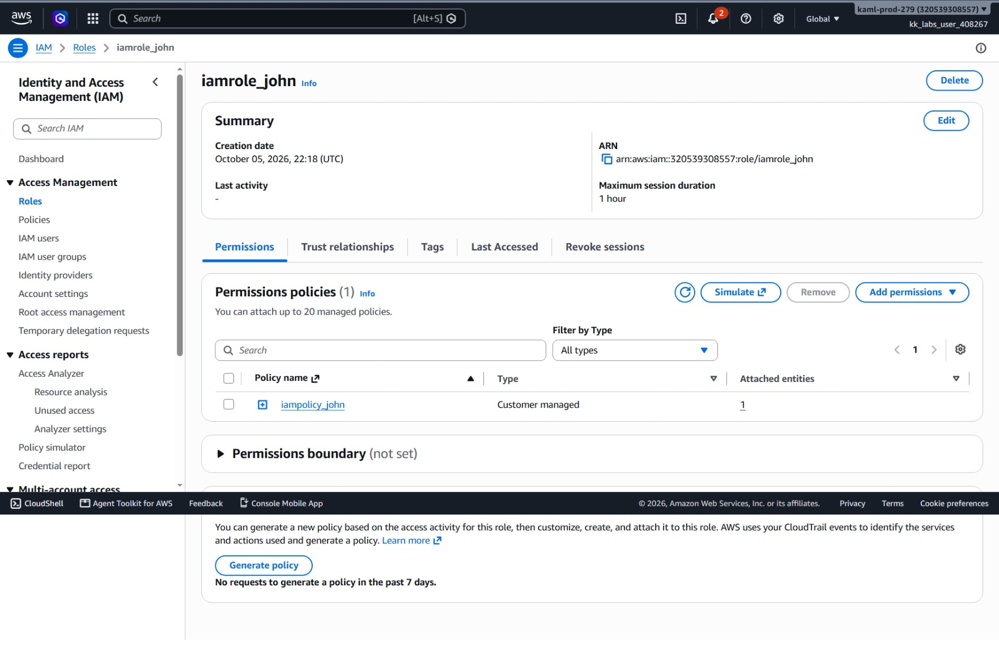
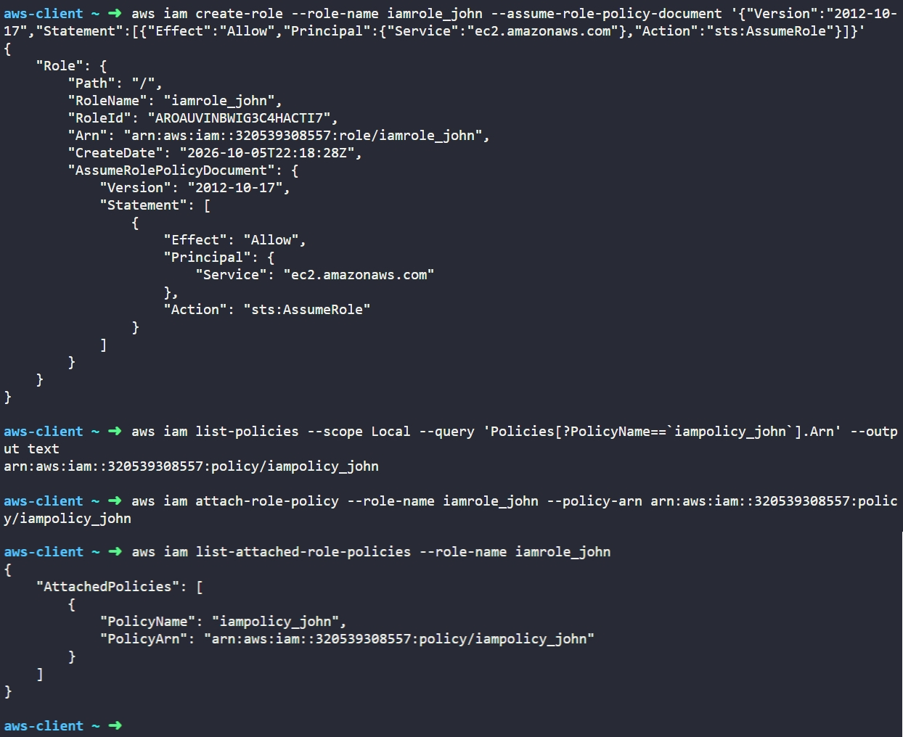

# Day 20: Create IAM Role for EC2 with Policy Attachment

## Objective
The objective is to create an AWS Identity and Access Management (IAM) role named `iamrole_john` for the Amazon EC2 service and attach the customer-managed policy `iampolicy_john` using the AWS CLI. This enables EC2 instances to securely assume this role and access AWS resources without storing hardcoded credentials on the server.

## 1. IAM Roles for EC2

An **IAM role** is an identity we create in our account that has specific permissions, but it is not tied to a single person. Instead, it is meant to be assumed by an AWS service (such as EC2) or a user temporarily.

### How IAM Roles Work

An IAM role relies on two separate policies:

1. **Trust Policy (`AssumeRolePolicyDocument`):** Defines **who** is allowed to assume the role. For an EC2 role, the trusted entity (Principal) is `ec2.amazonaws.com`, and the allowed action is `sts:AssumeRole`. This gives the EC2 service permission to take on the role.

2. **Permissions Policy:** Defines **what** actions are allowed once the role is assumed. This is the standard policy attached to the role (such as `iampolicy_john`).


## 2. Command Execution

### Step 1: Create the IAM Role with a Trust Policy
I created the role and supplied the trust policy allowing the EC2 service to assume it:

```bash
aws iam create-role --role-name iamrole_john --assume-role-policy-document '{"Version":"2012-10-17","Statement":[{"Effect":"Allow","Principal":{"Service":"ec2.amazonaws.com"},"Action":"sts:AssumeRole"}]}'
```

### Argument Breakdown:
* `aws iam`: Calls the Identity and Access Management service.
* `create-role`: Creates a new IAM role in the account.
* `--role-name iamrole_john`: Sets the name of the role.
* `--assume-role-policy-document`: The JSON trust document that grants `ec2.amazonaws.com` permission to call `sts:AssumeRole`.

Created Role Details:
* **RoleName:** `iamrole_john`
* **RoleId:** `AROAUVINBWIG3C4HACTI7`
* **Arn:** `arn:aws:iam::320539308557:role/iamrole_john`

### Step 2: Retrieve the Policy ARN
I retrieved the Amazon Resource Name (ARN) for the existing policy named `iampolicy_john`:

```bash
aws iam list-policies --scope Local --query 'Policies[?PolicyName==`iampolicy_john`].Arn' --output text
```

* `--scope Local`: Restricts the search to customer-created policies in the account.
* `--query`: Extracts only the ARN of the matching policy.

Target Policy ARN: `arn:aws:iam::320539308557:policy/iampolicy_john`

### Step 3: Attach the Policy to the Role
I attached the policy to the newly created role:

```bash
aws iam attach-role-policy --role-name iamrole_john --policy-arn arn:aws:iam::320539308557:policy/iampolicy_john
```

* `attach-role-policy`: Links a managed policy to an existing IAM role.
* `--role-name iamrole_john`: The target role receiving the permissions.
* `--policy-arn`: The full ARN of the policy being attached.

## 3. Verification

### CLI Verification
I queried the role's attached policies to confirm the link:

```bash
aws iam list-attached-role-policies --role-name iamrole_john
```

* `list-attached-role-policies`: Displays all managed policies attached to a specific role.

Output:
```json
{
    "AttachedPolicies": [
        {
            "PolicyName": "iampolicy_john",
            "PolicyArn": "arn:aws:iam::320539308557:policy/iampolicy_john"
        }
    ]
}
```

### Console UI Verification
I signed into the AWS Management Console to visually confirm the configuration:
1. Navigated to the **IAM** service console.
2. Selected **Roles** from the left navigation menu.
3. Searched for and selected `iamrole_john`.
5. Checked the **Permissions** tab:
   * `iampolicy_john` is listed under **Permissions policies**.



## Result
I verified that the `iamrole_john` IAM role was successfully created with a trust relationship for `ec2.amazonaws.com` and that `iampolicy_john` was attached. Both the AWS CLI and the AWS Management Console confirm the role is ready to be assigned to an EC2 instance profile.

## Screenshots

