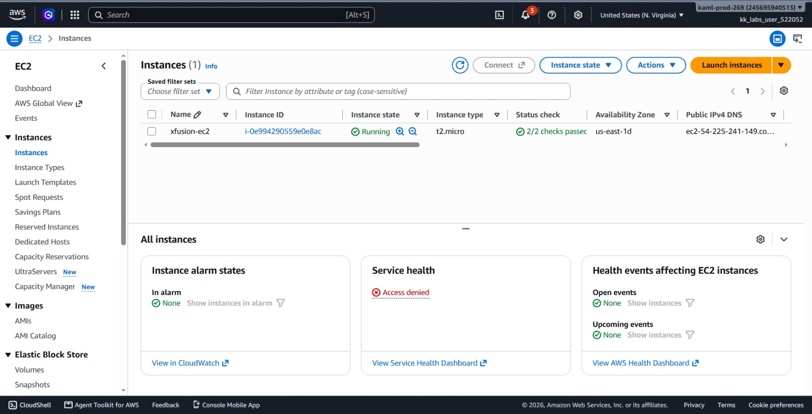
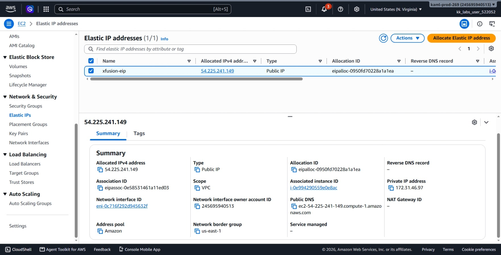
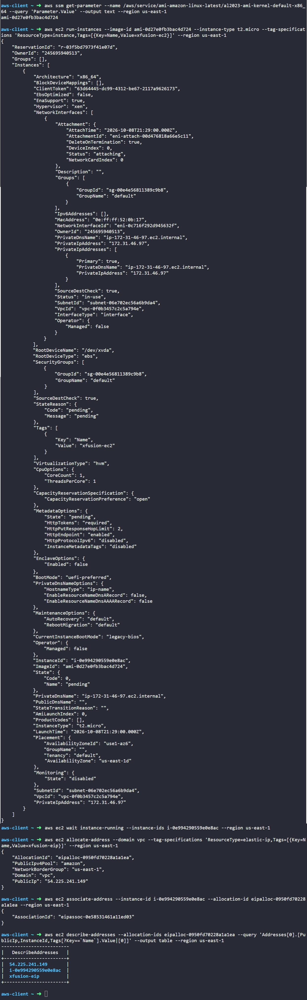

# Day 21: Setting Up an EC2 Instance with an Elastic IP for Application Hosting

## Objective
The objective is to launch an Amazon EC2 instance named `xfusion-ec2` (type `t2.micro`) and allocate and associate a static Elastic IP named `xfusion-eip` in the `us-east-1` region using the AWS CLI. This ensures the hosted application has a permanent public IP address that remains unchanged across server reboots.

## 1. EC2 and Elastic IP Integration

An **EC2 instance** provides compute capacity, while an **Elastic IP (EIP)** provides a static public IPv4 address.

### Why Use an Elastic IP
1. **Permanent Public IP:** When we launch an EC2 instance with a regular public IP, that IP address changes every time the instance is stopped and started. An Elastic IP stays the same until we choose to release it.
2. **Consistent Endpoint:** Having a fixed public IP allows developers to connect to the application and point DNS records to the server without worrying about IP changes after server maintenance.

### Two-Step IP Process
* **Allocation:** Reserving an IP address from the AWS pool for our account. This gives us an `AllocationId`.
* **Association:** Linking that reserved IP address to a running EC2 instance. This gives us an `AssociationId`.

## 2. Command Execution

### Step 1: Find the Amazon Linux AMI
I retrieved the latest Amazon Linux 2023 AMI ID using the AWS Systems Manager Parameter Store:

```bash
aws ssm get-parameter --name /aws/service/ami-amazon-linux-latest/al2023-ami-kernel-default-x86_64 --query 'Parameter.Value' --output text --region us-east-1
```

* `get-parameter`: Reads configuration data from Systems Manager.
* `--name`: Points to the official AWS path for the latest Amazon Linux 2023 AMI.

Found AMI ID: `ami-0d27e0fb3bac4d724`

### Step 2: Launch the EC2 Instance
I launched the instance with the `t2.micro` size and tagged it as `xfusion-ec2`:

```bash
aws ec2 run-instances --image-id ami-0d27e0fb3bac4d724 --instance-type t2.micro --tag-specifications 'ResourceType=instance,Tags=[{Key=Name,Value=xfusion-ec2}]' --region us-east-1
```

* `run-instances`: Launches a new virtual server.
* `--image-id ami-0d27e0fb3bac4d724`: Specifies the Amazon Linux image.
* `--instance-type t2.micro`: Sets the hardware size (1 vCPU, 1 GiB RAM).
* `--tag-specifications`: Sets the Name tag to `xfusion-ec2`.

Created Instance ID: `i-0e994290559e0e8ac`

### Step 3: Wait for the Instance to Run
I waited until the instance finished booting and reached the `running` state:

```bash
aws ec2 wait instance-running --instance-ids i-0e994290559e0e8ac --region us-east-1
```

* `wait instance-running`: Pauses until the instance state changes from `pending` to `running`.

### Step 4: Allocate the Elastic IP
I allocated a new Elastic IP and tagged it as `xfusion-eip`:

```bash
aws ec2 allocate-address --domain vpc --tag-specifications 'ResourceType=elastic-ip,Tags=[{Key=Name,Value=xfusion-eip}]' --region us-east-1
```

* `allocate-address`: Reserves a static public IPv4 address from AWS.
* `--domain vpc`: Allocates the IP for use in a VPC.
* `--tag-specifications`: Sets the Name tag to `xfusion-eip`.

Allocated Details:
* **AllocationId:** `eipalloc-0950fd70228a1a1ea`
* **PublicIp:** `54.225.241.149`

### Step 5: Associate the Elastic IP to the Instance
I linked the allocated Elastic IP to the running EC2 instance:

```bash
aws ec2 associate-address --instance-id i-0e994290559e0e8ac --allocation-id eipalloc-0950fd70228a1a1ea --region us-east-1
```

* `associate-address`: Attaches the Elastic IP to the server.
* `--instance-id`: The target server (`i-0e994290559e0e8ac`).
* `--allocation-id`: The reserved Elastic IP (`eipalloc-0950fd70228a1a1ea`).

Created Association ID: `eipassoc-0e58531461a11ed03`

## 3. Verification

### CLI Verification
I queried the Elastic IP details to confirm it was assigned to the instance and properly tagged:

```bash
aws ec2 describe-addresses --allocation-ids eipalloc-0950fd70228a1a1ea --query 'Addresses[0].[PublicIp,InstanceId,Tags[?Key==`Name`].Value|[0]]' --output table --region us-east-1
```

Output:
```text
-------------------------
|   DescribeAddresses   |
+-----------------------+
|  54.225.241.149       |
|  i-0e994290559e0e8ac  |
|  xfusion-eip          |
+-----------------------+
```

### Console UI Verification
I signed into the AWS Management Console to visually confirm both resources:
1. Navigated to **EC2** > **Instances**:
   * Verified `xfusion-ec2` has an instance state of **Running**.
   * Verified the instance type is **t2.micro**.
   * Verified the public IPv4 address shows `54.225.241.149`.



2. Navigated to **EC2** > **Network & Security** > **Elastic IPs**:
   * Located `xfusion-eip` and verified the IP is `54.225.241.149`.
   * Verified the **Associated instance ID** shows `i-0e994290559e0e8ac (xfusion-ec2)`.



## Result
I verified that the EC2 instance `xfusion-ec2` is running and successfully associated with the Elastic IP `xfusion-eip` (`54.225.241.149`) in `us-east-1`. Both the AWS CLI and the AWS Management Console confirm the static IP attachment is active.

## Screenshots
