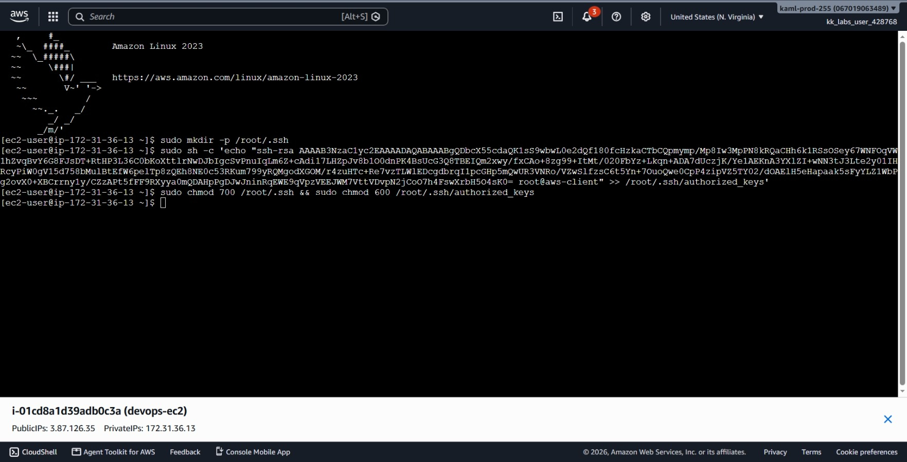
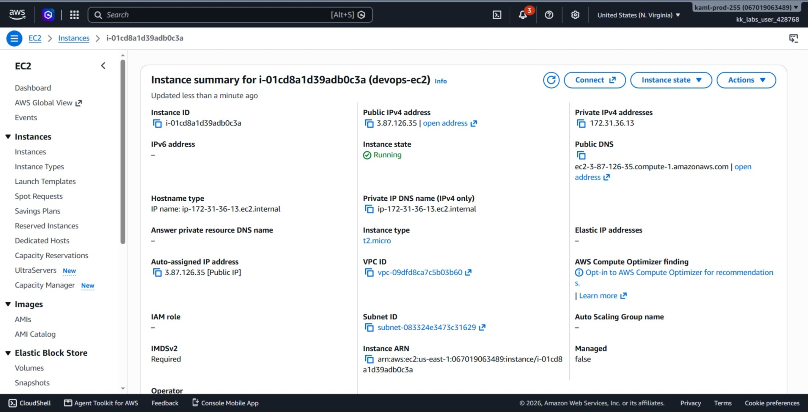
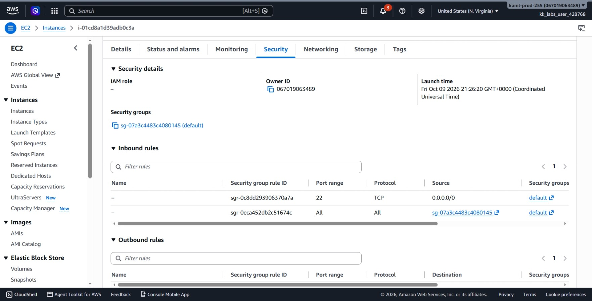
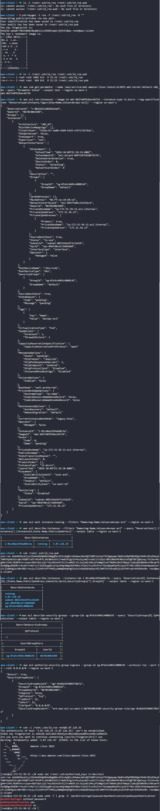

# Day 22: Configuring Secure SSH Access to an EC2 Instance


## Objective
The objective is to launch an Amazon EC2 instance named `devops-ec2` (type `t2.micro`) and configure passwordless SSH access directly to the `root` user from the `aws-client` host. I generated an RSA key pair on the client machine, launched the instance, configured the security group firewall to allow SSH traffic, and added the client's public key to the remote root user's `authorized_keys` file.

## 1. SSH Key Authentication & Root Access

SSH key authentication uses a public and private key pair to authenticate users without typing a password.

### Key Authentication Model
1. **Private Key (`id_rsa`):** Remains strictly on the client machine (`aws-client`). It must stay protected with restricted file permissions (`600`).
2. **Public Key (`id_rsa.pub`):** Placed onto the target server inside `/root/.ssh/authorized_keys`.
3. **The Handshake:** When connecting, the server challenges the client to prove ownership of the private key matching the stored public key. If verified, access is granted.


### File Permissions Requirement
SSH strictly enforces file system permissions on target Linux systems:
* The `.ssh` directory must have `700` permissions (`drwx------`).
* The `authorized_keys` file must have `600` permissions (`-rw-------`).
If these permissions are too open, the SSH daemon rejects the key connection for security reasons.

### SSH Daemon Settings (`sshd`)
By default, Amazon Linux 2023 sets `PermitRootLogin without-password`. This means root login with a standard password is blocked, but public key authentication is allowed.

### Security Group Ingress
Before an SSH connection can reach the virtual machine, the security group attached to the instance must have an inbound rule allowing TCP traffic on port 22.


## 2. Command Execution

### Step 1: Generate the SSH Key Pair on `aws-client`
I checked if an RSA key pair already existed under `/root/.ssh/` and generated one without a passphrase:

```bash
# Check existing keys
ls -l /root/.ssh/id_rsa /root/.ssh/id_rsa.pub

# Generate a new 3072-bit RSA key pair
ssh-keygen -t rsa -f /root/.ssh/id_rsa -N ""

# Confirm created key files
ls -l /root/.ssh/id_rsa /root/.ssh/id_rsa.pub
```

* `ssh-keygen`: The OpenSSH tool used to create key pairs.
* `-t rsa`: Specifies the RSA encryption standard.
* `-f /root/.ssh/id_rsa`: Sets the output file path.
* `-N ""`: Sets an empty passphrase for automated, non-interactive logins.


### Step 2: Launch the EC2 Instance
I retrieved the latest Amazon Linux 2023 AMI ID and launched the instance:

```bash
# Retrieve latest AMI ID
aws ssm get-parameter --name /aws/service/ami-amazon-linux-latest/al2023-ami-kernel-default-x86_64 --query "Parameter.Value" --output text --region us-east-1

# Launch the instance
aws ec2 run-instances --image-id ami-0d27e0fb3bac4d724 --instance-type t2.micro --tag-specifications 'ResourceType=instance,Tags=[{Key=Name,Value=devops-ec2}]' --region us-east-1
```

Created Instance ID: `i-01cd8a1d39adb0c3a`

I waited for the instance to reach the `running` state and retrieved its public IP and security group:

```bash
# Wait until running
aws ec2 wait instance-running --filters "Name=tag:Name,Values=devops-ec2" --region us-east-1

# Query instance details
aws ec2 describe-instances --instance-ids i-01cd8a1d39adb0c3a --query 'Reservations[0].Instances[0].[State.Name,PublicIpAddress,SubnetId,VpcId,SecurityGroups[*].GroupId]' --output table --region us-east-1
```

- Public IP assigned: `3.87.126.35`
- Attached Security Group: `sg-07a3c4483c4080145`


### Step 3: Authorize SSH Traffic in the Security Group

I tried connecting to the EC2 using The EC2 Instance Connect browser session initially but it failed..
So I inspected the default security group and found it only permitted internal traffic from members of the same group. I then added an inbound rule allowing SSH on port 22:

```bash
aws ec2 authorize-security-group-ingress --group-id sg-07a3c4483c4080145 --protocol tcp --port 22 --cidr 0.0.0.0/0 --region us-east-1
```

* `authorize-security-group-ingress`: Adds incoming firewall allow rules.
* `--protocol tcp --port 22`: Targets the standard SSH port.
* `--cidr 0.0.0.0/0`: Permits connections from any IP.


### Step 4: Inject Public Key into Root User on EC2
I printed my client's public key:

```bash
cat /root/.ssh/id_rsa.pub
```

I connected to the instance using the browser-based **EC2 Instance Connect** terminal in the AWS Management Console and injected the public key into the root user's `authorized_keys` file:

```bash
# Create directory and append the public key
sudo mkdir -p /root/.ssh
sudo sh -c 'echo "ssh-rsa AAAAB3NzaC1yc2EAAAADAQABAAABgQDbcX55... root@aws-client" >> /root/.ssh/authorized_keys'

# Set strict permissions
sudo chmod 700 /root/.ssh && sudo chmod 600 /root/.ssh/authorized_keys
```




## 3. Verification

### CLI Verification
From the `aws-client` terminal, I tested passwordless SSH access directly into the instance as the `root` user:

```bash
ssh -i /root/.ssh/id_rsa root@3.87.126.35
```

Once logged in, I verified the installed key and checked the SSH daemon configuration:

```bash
# Check key file
sudo cat /root/.ssh/authorized_keys 2>/dev/null

# Verify daemon allows public key root authentication
sudo sshd -T | grep -E 'permitrootlogin|passwordauthentication|pubkeyauthentication'
```

Output:
```text
permitrootlogin without-password
pubkeyauthentication yes
passwordauthentication no
```

### Console UI Verification
I confirmed the infrastructure in the AWS Management Console:
1. **EC2 Instances View:** Verified `devops-ec2` (`i-01cd8a1d39adb0c3a`) shows an **Instance state** of **Running** with public IP `3.87.126.35`.




2. **Security Groups View:** Selected `sg-07a3c4483c4080145` and confirmed the inbound rule list shows **SSH (Port 22)** open to `0.0.0.0/0`.




3. **EC2 Instance Connect View:** Confirmed successful browser terminal connectivity and verified the root `authorized_keys` commands executed.

## Result
I verified that the `devops-ec2` instance is running in `us-east-1` and accessible via direct, passwordless SSH as the `root` user from the `aws-client` host. Both CLI testing and console UI checks confirm the key pair, file permissions, and security group rules are properly configured.

## Screenshots
