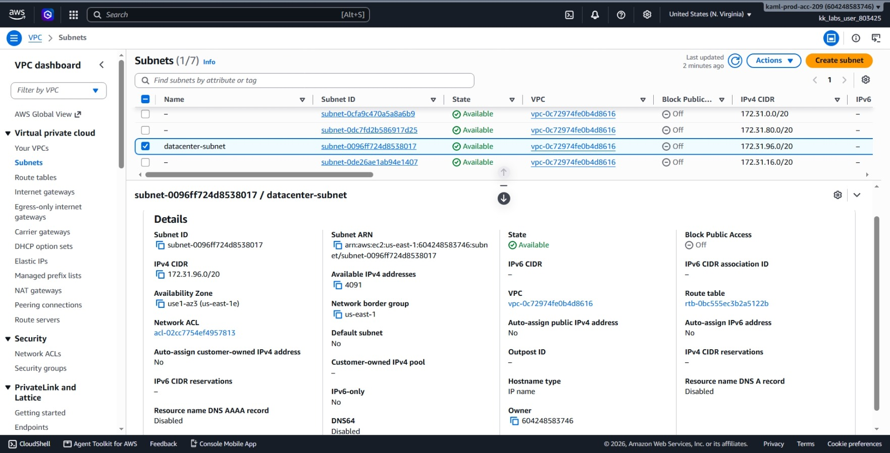
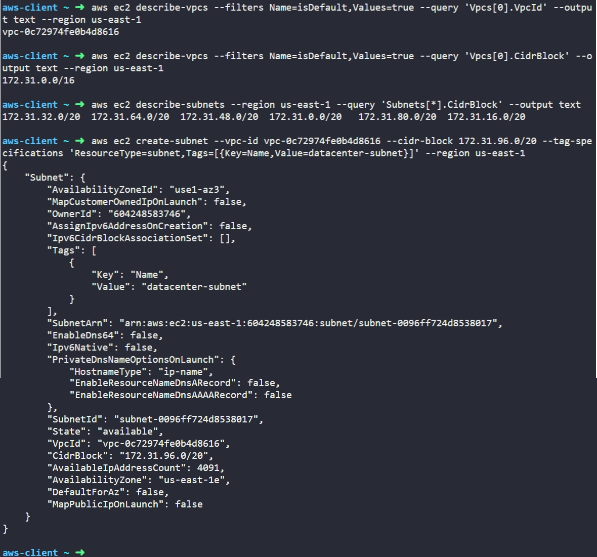

# Day 3: Create Subnet

## Objective
The objective is to create a new subnet named `datacenter-subnet` inside the default VPC in the `us-east-1` region using the AWS CLI. This task involves discovering the default VPC's network range, finding an available non-overlapping CIDR block, and provisioning the subnet with proper tagging.

## 1. VPC Subnets

A **Subnet** (sub-network) is a defined range of IP addresses within a Virtual Private Cloud (VPC) tied to a specific Availability Zone (AZ).

### Subnet Characteristics
* **Availability Zone Bound:** While a VPC spans an entire AWS Region, each individual subnet resides entirely inside a single Availability Zone.
* **Non-Overlapping Blocks:** Every subnet within a VPC must have a distinct CIDR block that does not overlap with any other subnet in that same VPC.
* **AWS Reserved IPs:** In every subnet, AWS reserves 5 IP addresses by default:
  1. The network address (first address).
  2. The VPC local router address.
  3. The AWS-provided DNS address.
  4. Future reserved address.
  5. The network broadcast address (last address).
  
For example, a `/20` subnet provides 4,096 total addresses, leaving 4,091 usable addresses for resources (`AvailableIpAddressCount: 4091`).

## 2. Command Execution

### Step 1: Identify Default VPC Details
I retrieved the ID and CIDR block of the default VPC in `us-east-1`:

```bash
# Get the default VPC ID
aws ec2 describe-vpcs --filters Name=isDefault,Values=true --query 'Vpcs[0].VpcId' --output text --region us-east-1

# Get the default VPC CIDR block
aws ec2 describe-vpcs --filters Name=isDefault,Values=true --query 'Vpcs[0].CidrBlock' --output text --region us-east-1
```

* `describe-vpcs`: Lists information about the account's VPCs.
* `--filters Name=isDefault,Values=true`: Filters specifically for the pre-configured default VPC.
* `--query`: Targets specific JSON keys (`VpcId` and `CidrBlock`).
* `--output text`: Returns a clean, raw text string.

Found:
* **VPC ID:** `vpc-0c72974fe0b4d8616`
* **VPC CIDR:** `172.31.0.0/16`

### Step 2: Check Existing Subnet CIDR Ranges
Before creating a new subnet, I checked all existing subnets to avoid IP collisions:

```bash
aws ec2 describe-subnets --region us-east-1 --query 'Subnets[*].CidrBlock' --output text
```

Output:
`172.31.32.0/20  172.31.64.0/20  172.31.48.0/20  172.31.0.0/20  172.31.80.0/20  172.31.16.0/20`

All existing default subnets were using `/20` slices (`172.31.0.0/20` through `172.31.80.0/20`). The next available, non-overlapping block was `172.31.96.0/20`.

### Step 3: Create the Subnet
I provisioned the subnet using the available CIDR block and tagged it with the required name:

```bash
aws ec2 create-subnet --vpc-id vpc-0c72974fe0b4d8616 --cidr-block 172.31.96.0/20 --tag-specifications 'ResourceType=subnet,Tags=[{Key=Name,Value=datacenter-subnet}]' --region us-east-1
```

### Argument Breakdown:
* `create-subnet`: The API action that provisions a new subnet.
* `--vpc-id`: Specifies the target parent VPC.
* `--cidr-block`: The IPv4 address range assigned to this subnet.
* `--tag-specifications`: Assigns metadata directly at creation time (`Key=Name,Value=datacenter-subnet`).
* `--region us-east-1`: Specifies the region.

Created Subnet ID: `subnet-0096ff724d8538017`

## 3. Verification

### CLI Verification
I queried the subnet by its ID to confirm its operational state and configuration:

```bash
aws ec2 describe-subnets --subnet-ids subnet-0096ff724d8538017 --region us-east-1
```

The output confirmed:
* **SubnetId:** `subnet-0096ff724d8538017`
* **State:** `available`
* **VpcId:** `vpc-0c72974fe0b4d8616`
* **CidrBlock:** `172.31.96.0/20`
* **AvailableIpAddressCount:** `4091`
* **Name Tag:** `datacenter-subnet`

### Console UI Verification
I logged into the AWS Management Console to visually confirm the subnet:
1. Navigated to the **VPC** service console in `us-east-1`.
2. Selected **Subnets** from the left navigation panel.
3. Located `datacenter-subnet` in the table and verified:
   * **IPv4 CIDR:** Matches `172.31.96.0/20`.
   * **VPC:** Bound to `vpc-0c72974fe0b4d8616`.
   * **Status:** Displays as **Available**.



## Result
I verified that the `datacenter-subnet` was successfully created under the default VPC in `us-east-1` with a valid, non-overlapping CIDR block (`172.31.96.0/20`). Both the AWS CLI and AWS Management Console confirm the subnet is active and ready to host resources.

## Screenshots
