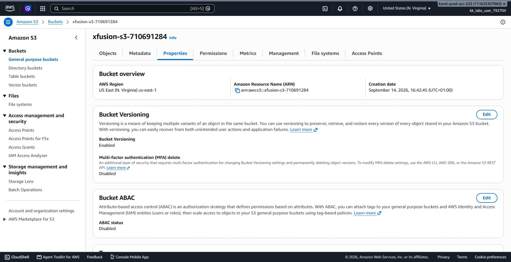
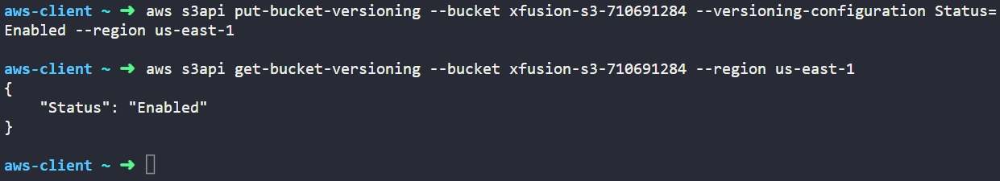

# Day 4: Enable Versioning for S3 Bucket


## Objective
The objective is to enable S3 Bucket Versioning on an existing S3 bucket named `xfusion-s3-710691284` in the `us-east-1` region using the AWS CLI. This provides data protection against accidental deletion and overwrites by retaining historical versions of objects stored in the bucket.

## 1. S3 Bucket Versioning

Amazon S3 **Versioning** is a bucket-level configuration that preserves multiple versions of an object within the same bucket.

### Versioning States
An S3 bucket can be in one of three versioning states:
1. **Unversioned (Default):** Versioning has never been enabled. Overwriting an object replaces it, and deleting an object removes it permanently.
2. **Enabled:** Every write operation generates a unique `VersionId` for the object. Overwriting an object creates a new current version while preserving older versions.
3. **Suspended:** Once versioning is enabled, it cannot be returned to unversioned; it can only be suspended. Existing versions remain stored, but newly written objects receive a `VersionId` of `null`.

### Delete Markers and Recovery
When an object in a versioned bucket is deleted without specifying a version ID:
* S3 does not physically remove the data. Instead, it inserts a **Delete Marker** with its own unique version ID, which becomes the current version.
* The object appears deleted in standard queries.
* To recover the object, we simply delete the delete marker, which restores the previous version as the current one.
* Permanent deletion requires explicitly deleting the object while specifying its exact `VersionId`.

## 2. Command Execution

I enabled versioning on the target S3 bucket using the `s3api` utility:

```bash
aws s3api put-bucket-versioning --bucket xfusion-s3-710691284 --versioning-configuration Status=Enabled --region us-east-1
```

### Argument Breakdown:
* `aws s3api`: Directly calls the lower-level Amazon S3 API operations (compared to the higher-level `aws s3` file-management commands).
* `put-bucket-versioning`: The specific API call used to apply or update bucket versioning configuration.
* `--bucket xfusion-s3-710691284`: Identifies the target S3 bucket.
* `--versioning-configuration Status=Enabled`: Sets the versioning state payload to active.
* `--region us-east-1`: Specifies the AWS region where the bucket resides.

## 3. Dual Verification

### CLI Verification
I queried the bucket's versioning configuration to confirm the state change:

```bash
aws s3api get-bucket-versioning --bucket xfusion-s3-710691284 --region us-east-1
```

* `get-bucket-versioning`: Returns the current versioning state of the specified bucket.

The terminal confirmed the configuration:
```json
{
    "Status": "Enabled"
}
```

### Console UI Verification
I signed into the AWS Management Console to visually confirm the configuration:
1. Navigated to the **S3** service console.
2. Selected the bucket `xfusion-s3-710691284` from the **Buckets** list.
3. Switched to the **Properties** tab.
4. Located the **Bucket Versioning** panel and confirmed that the status shows **Enabled**.



## Result
I verified that bucket versioning is active on `xfusion-s3-710691284` in `us-east-1`. Both the AWS CLI and the AWS Management Console confirm that historical versions and delete markers will now be tracked for all objects stored in the bucket.

## Screenshots
