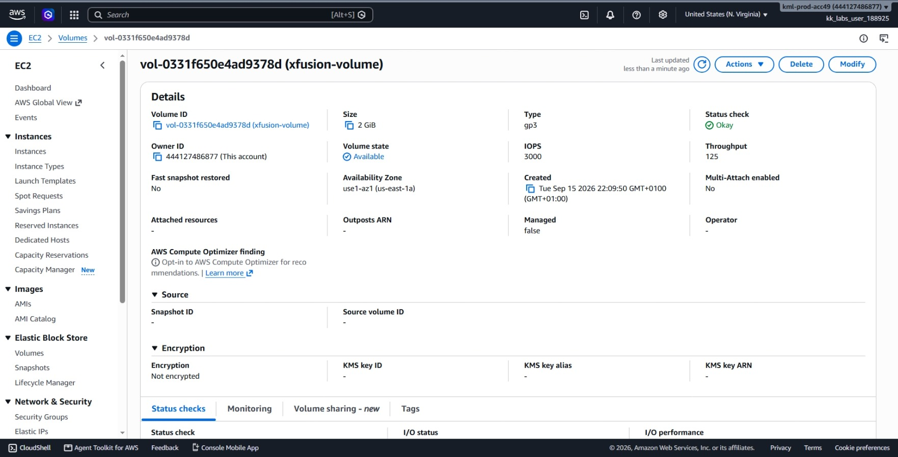
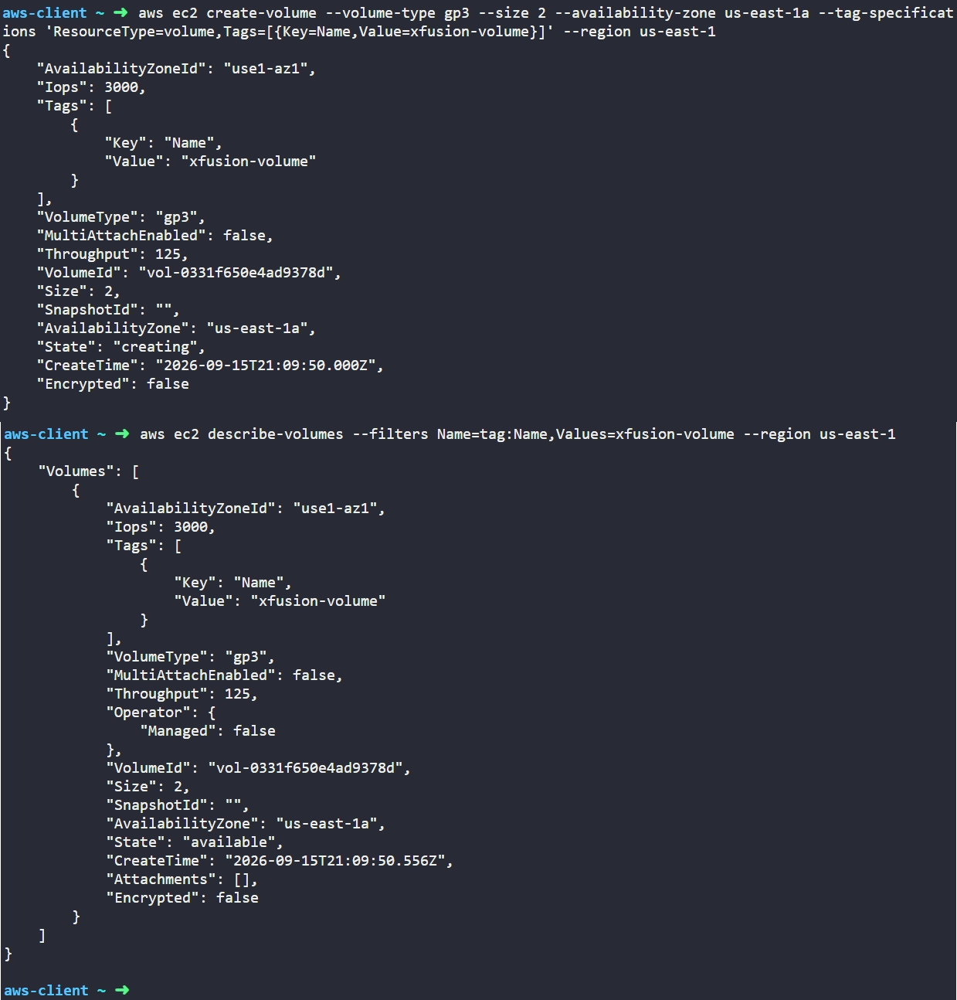

# Day 5: Create GP3 Volume


## Objective
The objective is to create an Amazon Elastic Block Store (EBS) volume named `xfusion-volume` with a capacity of 2 GiB and volume type `gp3` in the `us-east-1` region using the AWS CLI. This volume provides persistent block-level storage for future EC2 instances.

## 1. Amazon EBS and GP3 Volumes

Amazon **Elastic Block Store (EBS)** provides persistent block storage designed for use with Amazon EC2 instances.

### Availability Zone Constraint
EBS volumes are tied to a single **Availability Zone (AZ)**. An EBS volume can only be attached to an EC2 instance that resides within that exact same AZ. Moving an EBS volume to another AZ requires taking a snapshot and restoring it as a new volume in the destination zone.

### Volume Lifecycle States
* **creating:** The storage is being allocated in the AWS storage cluster.
* **available:** The volume is fully provisioned and ready to be attached to an EC2 instance.
* **in-use:** The volume is currently attached to one or more EC2 instances.

## 2. Command Execution

I provisioned the EBS volume in `us-east-1a` using the `aws ec2 create-volume` command:

```bash
aws ec2 create-volume --volume-type gp3 --size 2 --availability-zone us-east-1a --tag-specifications 'ResourceType=volume,Tags=[{Key=Name,Value=xfusion-volume}]' --region us-east-1
```

### Argument Breakdown:
* `aws ec2 create-volume`: The API operation that provisions a new EBS volume.
* `--volume-type gp3`: Specifies the General Purpose SSD (gp3) volume type.
* `--size 2`: Allocates 2 GiB of storage capacity.
* `--availability-zone us-east-1a`: Designates the physical Availability Zone where the block device will exist.
* `--tag-specifications 'ResourceType=volume,Tags=[{Key=Name,Value=xfusion-volume}]'`: Assigns the `Name` tag directly upon creation.
* `--region us-east-1`: Targets the US East (N. Virginia) region.

Created Volume ID: `vol-0331f650e4ad9378d`

## 3. Verification

### CLI Verification
I queried the volume details using its ID to ensure it transitioned from `creating` to `available`:

```bash
aws ec2 describe-volumes --volume-ids vol-0331f650e4ad9378d --region us-east-1
```

* `describe-volumes`: Queries metadata and current state for EBS volumes.
* `--volume-ids vol-0331f650e4ad9378d`: Restricts the output to the newly created volume.

The output confirmed:
* **VolumeId:** `vol-0331f650e4ad9378d`
* **State:** `available`
* **Size:** `2`
* **VolumeType:** `gp3`
* **Iops:** `3000`
* **Throughput:** `125`
* **AvailabilityZone:** `us-east-1a`
* **Tag:** `Name = xfusion-volume`

### Console UI Verification

I signed into the AWS Management Console to visually inspect the EBS resource:
1. Selected region **us-east-1 (N. Virginia)**.
2. Navigated to **EC2** > **Elastic Block Store** > **Volumes**.
3. Located `xfusion-volume` in the volume list and verified:
   * **Volume ID:** `vol-0331f650e4ad9378d`
   * **State:** Displays as **Available** (blue status).
   * **Size:** Displays as **2 GiB**.
   * **Volume Type:** Displays as **gp3**.
   * **IOPS:** Displays as **3000**.
   * **Availability Zone:** Displays as **us-east-1a**.



## Result
I verified that the `xfusion-volume` EBS volume was successfully created in `us-east-1a` with 2 GiB of gp3 storage. Both the AWS CLI and AWS Management Console confirm the volume is in the `available` state and ready to attach to an EC2 instance.

## Screenshots
