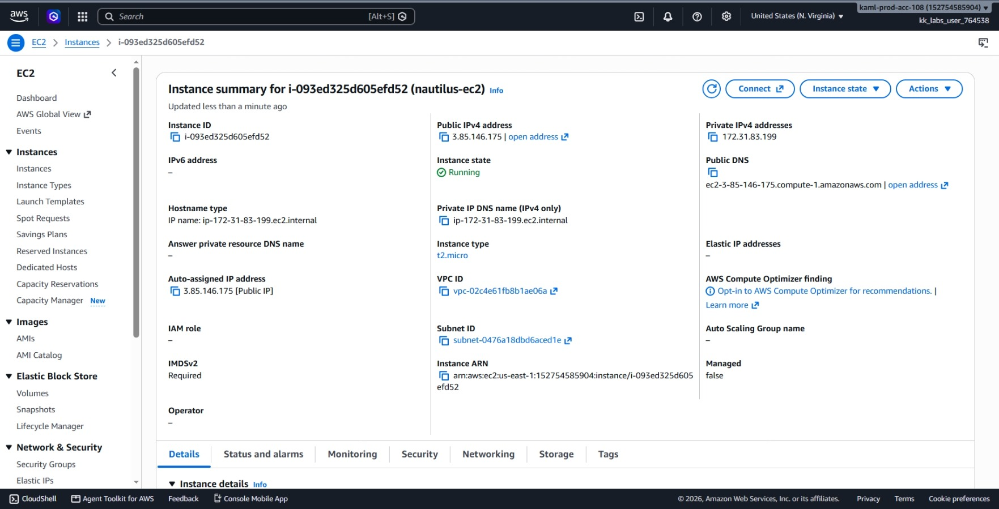
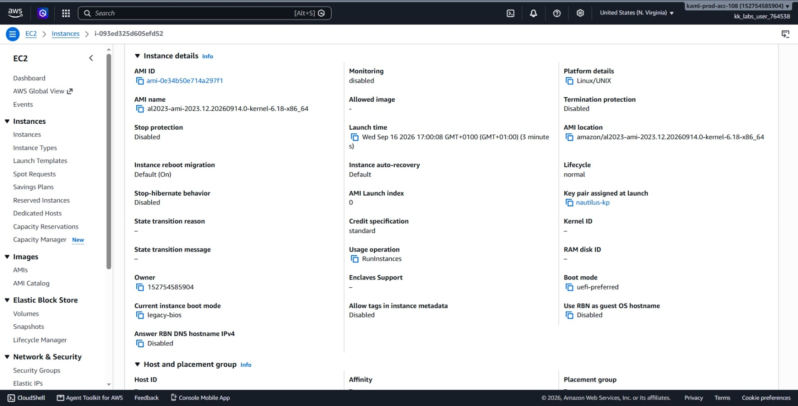
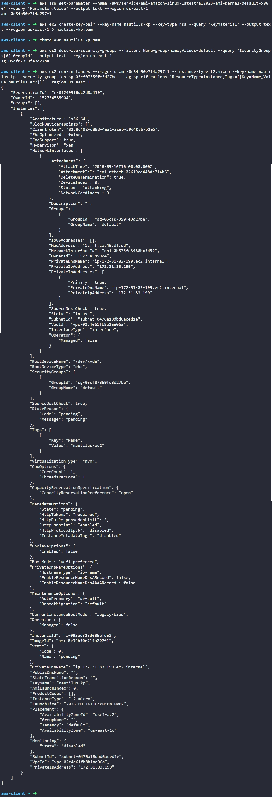

# Day 6: Launch EC2 Instance

## Objective

The objective was to launch and Amazon EC2 server with the name `nautilus-ec2` in the `us-east-1` region. Requirements specified that the instance must run Amazon Linux AMI, use the `t2.micro` size, connect to a newly created RSA key pair named `nautilus-kp`, and use the default security group.

## 1. EC2 Fundamentals

An **EC2 instance** is a virtual computer running on the AWS cloud. To start one, we'll need:

### Amazon Machine Image (AMI)
An AMI is the operating system template for the EC2 server. It contains the OS (like Amazon Linux or Ubuntu), initial packages, and base configurations.

### Instance Type
The instance type sets the CPU, memory (RAM), and network capacity of the server. `t2.micro` provides 1 vCPU and 1 GiB of RAM, which is standard for lightweight workloads and testing.

### Key Pair
A public and private key used to log in securely over SSH. AWS keeps the public key inside the instance, and we keep the private `.pem` file locally.

### Security Group
A virtual firewall that controls what network traffic can reach or leave the server.

## 2. Command Execution

### Step 1: Find the Amazon Linux AMI ID
I looked up the latest official Amazon Linux 2023 AMI ID using AWS Systems Manager Parameter Store:

```bash
aws ssm get-parameter --name /aws/service/ami-amazon-linux-latest/al2023-ami-kernel-default-x86_64 --query 'Parameter.Value' --output text --region us-east-1
```

* `get-parameter`: Pulls configuration data from AWS Systems Manager.
* `--name`: The public AWS path that always points to the newest Amazon Linux 2023 image.

Found AMI ID: `ami-0e34b50e714a297f1`

### Step 2: Create the Key Pair
I created the RSA key pair and saved the private key to a local file:

```bash
# Create key pair and save the private key text
aws ec2 create-key-pair \
  --key-name nautilus-kp \
  --key-type rsa \
  --query 'KeyMaterial' \
  --output text \
  --region us-east-1 \
  > nautilus-kp.pem

# Set private file permissions (read-only for user)
chmod 400 nautilus-kp.pem
```

* `--key-name nautilus-kp`: Sets the name of the key in AWS.
* `--key-type rsa`: Specifies standard RSA encryption.
* `chmod 400`: Makes the `.pem` file read-only so SSH clients accept it.

### Step 3: Get the Default Security Group ID
I queried AWS to find the ID of the default security group in the region:

```bash
aws ec2 describe-security-groups \
  --filters Name=group-name,Values=default \
  --query 'SecurityGroups[0].GroupId' \
  --output text \
  --region us-east-1
```

Found Security Group ID: `sg-05cf07359fe3d27be`

### Step 4: Launch the EC2 Instance
I launched the virtual server with all required settings:

```bash
aws ec2 run-instances \
  --image-id ami-0e34b50e714a297f1 \
  --instance-type t2.micro \
  --key-name nautilus-kp \
  --security-group-ids sg-05cf07359fe3d27be \
  --tag-specifications 'ResourceType=instance,Tags=[{Key=Name,Value=nautilus-ec2}]' \
  --region us-east-1
```

### Argument Breakdown:
* `run-instances`: Launches one or more new virtual servers.
* `--image-id`: Specifies the operating system (AMI ID).
* `--instance-type t2.micro`: Sets the hardware size (1 CPU, 1 GiB RAM).
* `--key-name nautilus-kp`: Links the server to my SSH key pair.
* `--security-group-ids`: Attaches the default firewall group.
* `--tag-specifications`: Assigns the name tag `nautilus-ec2` to the instance.

Created Instance ID: `i-093ed325d605efd52`

## 3. Verification

### Console UI Verification
I logged into the AWS Management Console to check the instance visually:
1. Switched to region **us-east-1 (N. Virginia)**.
2. Navigated to **EC2** > **Instances**.
3. Located `nautilus-ec2` (`i-093ed325d605efd52`) in the list.
4. Checked the **Details** tab to verify:
   * **Instance state:** `Running` (green status).
   * **Instance type:** `t2.micro`.
   * **Key pair name:** `nautilus-kp`.
   * **Security groups:** `default`.




## Result
I verified that the `nautilus-ec2` instance launched successfully in `us-east-1`. Both the AWS CLI and AWS Management Console confirm the server is running with the requested AMI, instance size, key pair, and security group.

## Screenshots
