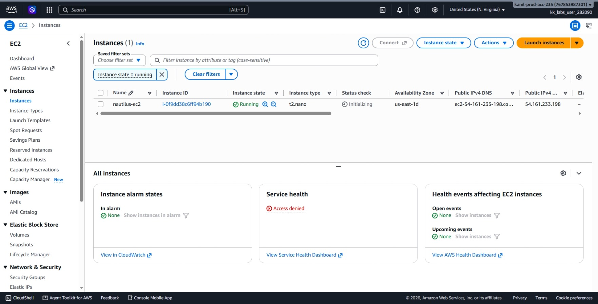
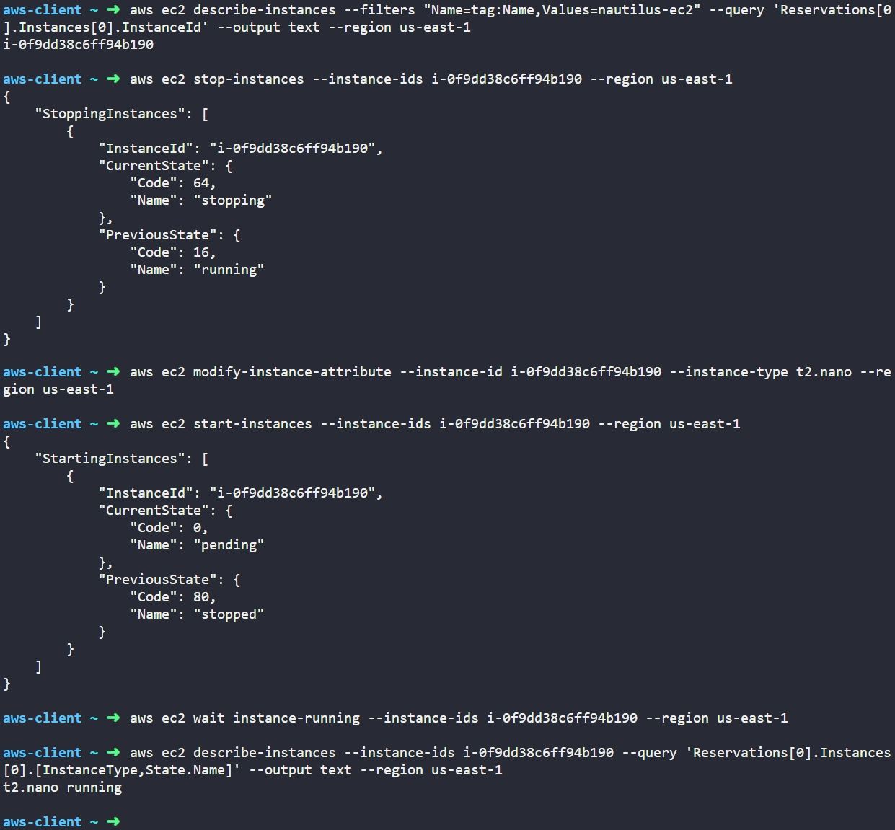

# Day 7: Change EC2 Instance Type


## Objective
The objective is to resize an existing EC2 instance named `nautilus-ec2` from `t2.micro` to `t2.nano` in the `us-east-1` region using the AWS CLI.

## 1. Resizing EC2 Instances

Changing an EC2 instance type is known as **vertical scaling** (adjusting CPU and RAM capacity on an existing server).

### The Stopped State Requirement
To change the hardware size of an EBS-backed EC2 instance, the instance must first be in the **stopped** state. We can't modify the CPU or memory while the virtual machine is running. Stopping the instance allows AWS to detach it from the current physical host and move it to hardware that matches the new size specification.

### Data and Network Behavior During a Resize

* **Data Safety:** The attached EBS root volume preserves all files, installed programs, and configurations. No data is lost during the resize process.
* **Public IP Changes:** Unless the instance uses an Elastic IP, stopping and restarting the instance will assign it a new dynamic public IPv4 address.
* **Compatibility:** The new instance type must match the processor architecture (x86_64) and virtualization type (HVM) of the original AMI. Moving between `t2.micro` (1 vCPU, 1 GiB RAM) and `t2.nano` (1 vCPU, 0.5 GiB RAM) is fully supported because both belong to the same T2 family.

## 2. Command Execution

### Step 1: Find the Instance ID
I queried the instance name tag to find its unique AWS identifier:

```bash
aws ec2 describe-instances --filters "Name=tag:Name,Values=nautilus-ec2" --query 'Reservations[0].Instances[0].InstanceId' --output text --region us-east-1
```

* `describe-instances`: Retrieves information about EC2 instances.
* `--filters "Name=tag:Name,Values=nautilus-ec2"`: Finds the instance with the exact name tag.
* `--query 'Reservations[0].Instances[0].InstanceId'`: Filters the output to display only the instance ID string.

Target Instance ID: `i-0f9dd38c6ff94b190`

### Step 2: Stop the Instance
I stopped the instance so its hardware attributes could be edited:

```bash
aws ec2 stop-instances --instance-ids i-0f9dd38c6ff94b190 --region us-east-1
```

* `stop-instances`: Stops the target instance.

The instance transitions from `running` to `stopping` and then `stopped`.

### Step 3: Modify the Instance Type
With the server stopped, I updated the hardware type:

```bash
aws ec2 modify-instance-attribute --instance-id i-0f9dd38c6ff94b190 --instance-type t2.nano --region us-east-1
```

* `modify-instance-attribute`: Updates configuration attributes on a stopped instance.
* `--instance-type t2.nano`: Sets the new size to 1 vCPU and 0.5 GiB RAM.

### Step 4: Start the Instance and Wait
I restarted the instance with the new size and waited for it to be fully operational:

```bash
# Start the instance
aws ec2 start-instances --instance-ids i-0f9dd38c6ff94b190 --region us-east-1

# Pause execution until the instance is back in the running state
aws ec2 wait instance-running --instance-ids i-0f9dd38c6ff94b190 --region us-east-1
```

* `start-instances`: Powers on the stopped instance.
* `wait instance-running`: Blocks further commands until the instance finishes booting and enters the `running` state.

## 3. Verification

### CLI Verification
I queried the instance to verify both the new size and its current power state:

```bash
aws ec2 describe-instances --instance-ids i-0f9dd38c6ff94b190 --query 'Reservations[0].Instances[0].[InstanceType,State.Name]' --output text --region us-east-1
```

Output:
```text
t2.nano running
```

### Console UI Verification
I signed into the AWS Management Console to visually confirm the change:
1. Navigated to the **EC2** console in the **us-east-1** region.
2. Selected **Instances** from the left-hand menu.
3. Located `nautilus-ec2` (`i-0f9dd38c6ff94b190`) and checked the details:
   * **Instance state:** Shows **Running** (green indicator).
   * **Instance type:** Shows **t2.nano**.



## Result
I verified that the `nautilus-ec2` instance was successfully resized from `t2.micro` to `t2.nano` in the `us-east-1` region. Both the AWS CLI and AWS Management Console confirm the instance is active, running, and using the updated resource profile.

## Screenshots

