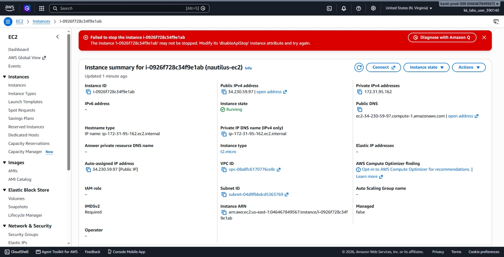
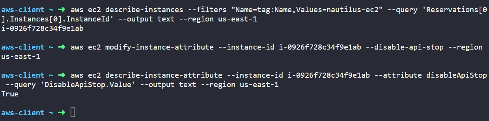

# Day 8: Enable Stop Protection for EC2 Instance

## Objective
The objective is to enable stop protection on an existing EC2 instance named `nautilus-ec2` in the `us-east-1` region using the AWS CLI. This setting protects critical production servers from being accidentally powered down or stopped by automation scripts or users.

## 1. EC2 Stop Protection

In AWS, EC2 instances have built-in guardrails to protect against human error and operational accidents.

### What is Stop Protection?
Stop protection (`DisableApiStop`) is an instance attribute that blocks API calls, CLI commands, and console actions that attempt to stop the instance. When enabled, any attempt to stop the server returns an error.

### Stop Protection vs. Termination Protection
* **Termination Protection (`DisableApiTermination`):** Prevents an instance from being permanently deleted or destroyed.
* **Stop Protection (`DisableApiStop`):** Prevents an instance from being powered off or put into the `stopped` state.

### Operational Safety
For critical workloads like databases or web application servers, accidental stops cause immediate service downtime. Turning on stop protection adds a mandatory extra step: an engineer must explicitly remove the stop protection attribute before the server can be powered down.

## 2. Command Execution

### Step 1: Find the Instance ID
I queried the instance by its name tag to retrieve its AWS identifier:

```bash
aws ec2 describe-instances --filters "Name=tag:Name,Values=nautilus-ec2" --query 'Reservations[0].Instances[0].InstanceId' --output text --region us-east-1
```

* `describe-instances`: Retrieves information about instances.
* `--filters "Name=tag:Name,Values=nautilus-ec2"`: Filters specifically for the target instance.
* `--query 'Reservations[0].Instances[0].InstanceId'`: Extracts just the instance ID.

Target Instance ID: `i-0926f728c34f9e1ab`

### Step 2: Enable Stop Protection
I modified the instance attribute to turn on stop protection:

```bash
aws ec2 modify-instance-attribute --instance-id i-0926f728c34f9e1ab --disable-api-stop --region us-east-1
```

### Argument Breakdown:
* `modify-instance-attribute`: Changes a specific configuration setting on an instance.
* `--instance-id i-0926f728c34f9e1ab`: Specifies the target server.
* `--disable-api-stop`: Enables stop protection (sets the attribute value to `true`).
* `--region us-east-1`: Sets the target AWS region.

## 3. Verification

### CLI Verification
I queried the specific instance attribute to confirm that stop protection is active:

```bash
aws ec2 describe-instance-attribute --instance-id i-0926f728c34f9e1ab --attribute disableApiStop --query 'DisableApiStop.Value' --output text --region us-east-1
```

* `describe-instance-attribute`: Checks a single configuration setting on an instance.
* `--attribute disableApiStop`: Focuses on the stop protection attribute.
* `--query 'DisableApiStop.Value'`: Pulls only the boolean result.

Output:
```text
True
```

### Console UI Verification
I signed into the AWS Management Console to visually confirm the configuration:
1. Switched to region **us-east-1 (N. Virginia)**.
2. Navigated to **EC2** > **Instances**.
3. Selected `nautilus-ec2` (`i-0926f728c34f9e1ab`).
4. In the **Details** tab, scrolled down to the **Stop protection** field and verified it displays as **Enabled**.
5. I then attempted to stop the EC2 instance, and got "Failed to stop the instance" due to the stop protection being enabled.



## Result
I verified that stop protection is successfully enabled on the `nautilus-ec2` instance in `us-east-1`. Both the AWS CLI output (`True`) and the AWS Management Console confirm the instance cannot be stopped without first disabling this safeguard.

## Screenshots
