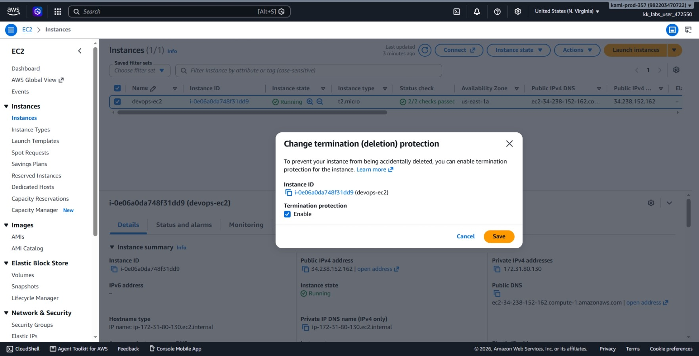
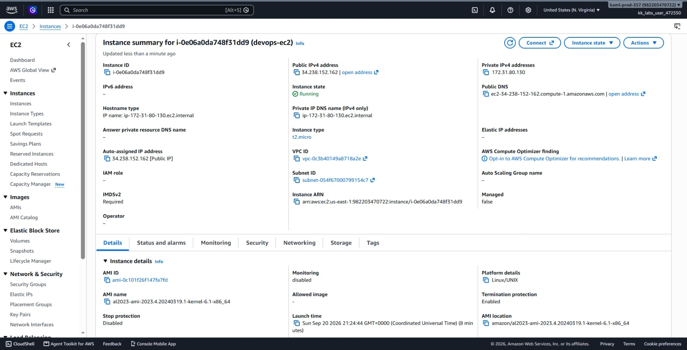
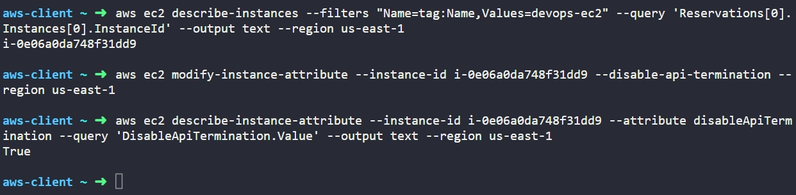

# Day 9: Enable Termination Protection for EC2 Instance


## Objective
The objective is to enable termination protection on an existing EC2 instance named `devops-ec2` in the `us-east-1` region using the AWS CLI. This setting guards production servers against accidental permanent deletion through API calls, scripts, or console actions.

## 1. EC2 Termination Protection

In AWS, terminating an EC2 instance destroys the virtual machine and deletes all attached storage volumes that have the "Delete on Termination" flag set.
So termination protection (`DisableApiTermination`) is an instance attribute that prevents anyone from terminating the server. When this attribute is set to `true`, any termination request sent to AWS fails with an unauthorized or operation-not-permitted error.

### Operational Safety
By default, termination protection is disabled (`false`). For production systems, enabling this setting adds a safety measure. To decommission or delete the server, an admin must deliberately turn off termination protection first, preventing accidental deletions during routine maintenance or script runs.

## 2. Command Execution

### Step 1: Retrieve the Instance ID
I queried AWS to find the instance ID associated with the name tag `devops-ec2`:

```bash
aws ec2 describe-instances --filters "Name=tag:Name,Values=devops-ec2" --query 'Reservations[0].Instances[0].InstanceId' --output text --region us-east-1
```

* `describe-instances`: Retrieves information about EC2 instances.
* `--filters "Name=tag:Name,Values=devops-ec2"`: Filters the search by the specific Name tag.
* `--query 'Reservations[0].Instances[0].InstanceId'`: Extracts only the instance ID string.

Target Instance ID: `i-0e06a0da748f31dd9`

### Step 2: Enable Termination Protection
I updated the instance attribute to activate termination protection:

```bash
aws ec2 modify-instance-attribute --instance-id i-0e06a0da748f31dd9 --disable-api-termination --region us-east-1
```

### Argument Breakdown:
* `modify-instance-attribute`: Updates configuration settings on a target instance.
* `--instance-id i-0e06a0da748f31dd9`: Specifies the target server ID.
* `--disable-api-termination`: Sets the termination protection attribute to `true`.
* `--region us-east-1`: Specifies the AWS region.

## 3. Verification

### CLI Verification
I queried the instance configuration directly to ensure the attribute changed to `True`:

```bash
aws ec2 describe-instance-attribute --instance-id i-0e06a0da748f31dd9 --attribute disableApiTermination --query 'DisableApiTermination.Value' --output text --region us-east-1
```

* `describe-instance-attribute`: Checks a specific configuration attribute of an EC2 instance.
* `--attribute disableApiTermination`: Inspects the termination protection flag.
* `--query 'DisableApiTermination.Value'`: Returns just the boolean value.

Output:
```text
True
```

### Console UI Verification
I signed into the AWS Management Console to verify the setting visually:
1. Switched to region **us-east-1 (N. Virginia)**.
2. Navigated to **EC2** > **Instances**.
3. Selected `devops-ec2` (`i-0e06a0da748f31dd9`).
4. In the **Details** tab, scrolled down to the **Termination protection** field and verified it displays as **Enabled**.




## Result
I verified that termination protection is active on the `devops-ec2` instance in `us-east-1`. Both the AWS CLI (`True`) and the AWS Management Console confirm the server cannot be accidentally terminated without explicitly disabling the protection first.

## Screenshots
